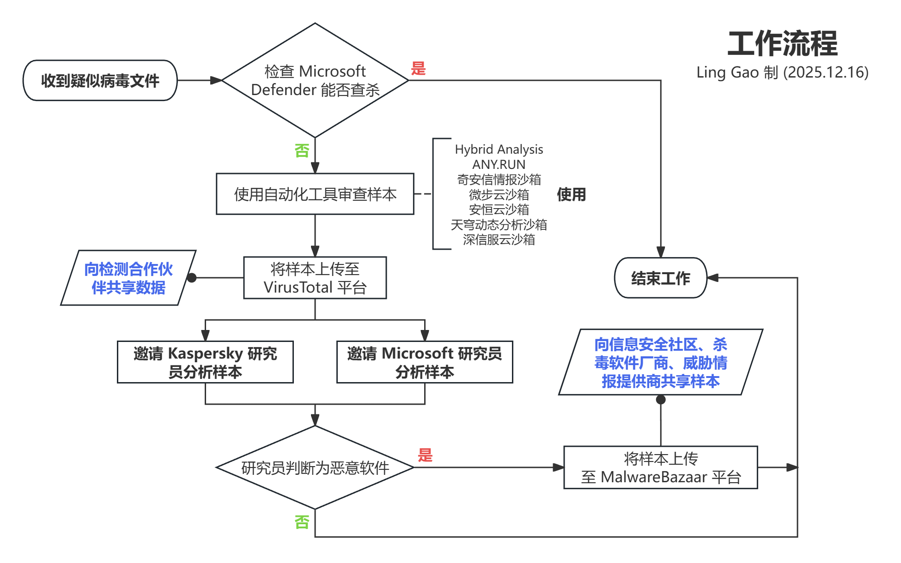

 

<h1 align="center">灵糕中心 · 安全响应分中心</h1>

<h3 align="center">(LGHUB · Security Response Center)</h3>

[github.com/Lingggao/LGSRC](https://github.com/Lingggao/LGSRC) (GitHub) & [lingggao.github.io/LGSRC](https://lingggao.github.io/LGSRC) (Pages)

&emsp;&emsp;**用于打击计算机病毒与恶意软件的 “[灵糕中心](https://github.com/Lingggao/LGHUB) · 安全响应分中心”**。由 2025 Microsoft Management Community Influencer · [**Ling Gao**](https://github.com/Lingggao) 先生领导。灵糕中心 · 安全响应分中心成立于 2025 年 12 月 20 日。

> [!IMPORTANT]
>
> &emsp;灵糕中心为个人项目，管理者不是 Microsoft 公司员工，不能代表 Microsoft 公司立场、态度。

&emsp;&emsp;**宗旨**：独立管理、放眼全球、数据精确、打击迅速

---

Microsoft - [Microsoft 安全响应中心](https://msrc.microsoft.com) | [Microsoft 安全情报](https://www.microsoft.com/en-us/wdsi) | [Microsoft Defender 门户](https://security.microsoft.com) | [获取更新](https://www.microsoft.com/en-us/wdsi/defenderupdates) | [提交文件](https://www.microsoft.com/en-us/wdsi/filesubmission)

研究 - [微步云沙箱](https://s.threatbook.com) | [奇安信威胁情报中心](https://ti.qianxin.com) | [安恒云沙箱](https://sandbox.dbappsecurity.com.cn) | [360 沙箱云](https://ata.360.net) | [天穹智能分析平台](https://sandbox.qianxin.com/sscc-tq-web) | [深信服威胁情报中心](https://ti.sangfor.com.cn/analysis-platform?lang=ZH-CN) | [国家计算机病毒协同分析平台 (国家计算机病毒应急处理中心)](http://110.41.132.165/#/entirety/upload) | [可疑文件分析云 (计算机病毒防御技术国家工程实验室)](https://cloud.vdnel.cn) | [VirusTotal](https://www.virustotal.com/gui/home/upload) | [MalwareBazaar](https://bazaar.abuse.ch) | [URLhaus](https://urlhaus.abuse.ch) | [YARAify](https://yaraify.abuse.ch) | [ThreatFox](https://threatfox.abuse.ch) | [Kaspersky OpenTIP](https://opentip.kaspersky.com) | [Hybrid Analysis](https://hybrid-analysis.com) | [ANY.RUN](https://app.any.run)

举报 - [中央网信办 违法和不良信息举报中心](https://www.12377.cn/index.html) | [网络违法犯罪信息举报网站](https://cyberpolice.mps.gov.cn/wfjb/#) | [网络不良与垃圾信息举报受理中心](https://www.12321.cn)

社区 - [卡饭论坛 病毒样本 分享&分析区](https://bbs.kafan.cn/forum-31-1.html) | [火绒安全论坛 病毒查杀问题反馈](https://bbs.huorong.cn/forum-44-1.html) | [百度贴吧 病毒吧](https://tieba.baidu.com/f?ie=utf-8&kw=%E7%97%85%E6%AF%92)

学习 - [Microsoft 认证：安全性、合规性和标识基础知识](https://learn.microsoft.com/zh-cn/credentials/certifications/security-compliance-and-identity-fundamentals) | [Microsoft 认证：安全运营分析师助理](https://learn.microsoft.com/zh-cn/credentials/certifications/security-operations-analyst) | [Microsoft 认证：网络安全架构师专家](https://learn.microsoft.com/zh-cn/credentials/certifications/cybersecurity-architect-expert) | [ISC.AI 学苑 (360 数字安全集团)](https://study.360.net/frontend/home/home) | [阿里云 云安全高级工程师 ACP 认证](https://edu.aliyun.com/certification/acp04)

## 工作流程

**一、工作流程概述**

1. 发现 / 获得疑似恶意软件样本
2. 使用 Microsoft Defender (最新[安全智能](https://learn.microsoft.com/zh-cn/defender-endpoint/microsoft-defender-antivirus-updates)) 测试能否查杀
3. 如果不能，按工作流程开展前期研究
4. 请求 Microsoft 等公司研究员人工分析样本
5. 如果判断为恶意软件，则向全球信息安全社区、杀毒软件厂商、威胁情报提供商共享信息
6. (可选) 向国家有关部门提供线索
7. (可选) 针对仿冒正规软件投放病毒事件，向受害企业方共享线索
8. 将样本数据填写至下方表格

**二、满足以下条件时，样本数据不会填写至表格**

1. Microsoft Defender 可以查杀样本，无需人工分析
2. 经前期分析，可 100% 确认是正常文件
3. Microsoft 研究员判断样本干净 (Clean)
4. 样本首次发现日期距今已超过 30 天
5. 由其他从业人员 / 志愿者发现、分析、上报，本中心全程未参与

## 数据

&emsp;&emsp;上次更新时间：2026 年 1 月 9 日 20:00 (UTC+8)。

&emsp;&emsp;**截至 2026 年 1 月 9 日，已打击计算机病毒 / 恶意软件 173 个、恶意网站 36 个**。

---

【**计算机病毒 / 恶意软件**】

> [!CAUTION]
>
> &emsp;为确保安全，本中心**不提供**病毒 / 恶意软件样本下载服务。

|   日期   |          文件名          |           检测           |                            SHA256                            |             Internal ID              |                          VirusTotal                          |                        MalwareBazaar                         | 编号  |
| :------: | :----------------------: | :----------------------: | :----------------------------------------------------------: | :----------------------------------: | :----------------------------------------------------------: | :----------------------------------------------------------: | :---: |
| 2026/1/6 | Aegis Virus Scanner.exe  |  **Win32/Malgent!MSR**   | 1d4edfe3e4c16ccbc39bc1164ddf95b80f3a8954db5acdcc14c8483a40c1682a | f4699fe1-acf3-4b3f-9760-1c275c173c1a | [VirusTotal](https://www.virustotal.com/gui/file/1d4edfe3e4c16ccbc39bc1164ddf95b80f3a8954db5acdcc14c8483a40c1682a) (18) | [MalwareBazaar Database](https://bazaar.abuse.ch/sample/1d4edfe3e4c16ccbc39bc1164ddf95b80f3a8954db5acdcc14c8483a40c1682a) | A0144 |
| 2026/1/6 |    ChromeSetup···.msi    |  **Win32/Malgent!MSR**   | a826133b16e78530d1b391fe51c4097e135e83838e6b39a58e1eabb98e883e65 | 768d9362-188e-4773-b3ce-525235ccd83b | [VirusTotal](https://www.virustotal.com/gui/file/a826133b16e78530d1b391fe51c4097e135e83838e6b39a58e1eabb98e883e65) (14) | [MalwareBazaar Database](https://bazaar.abuse.ch/sample/a826133b16e78530d1b391fe51c4097e135e83838e6b39a58e1eabb98e883e65) | A0145 |
| 2026/1/6 |     shurufa15.12.msi     |  **Win32/Malgent!MSR**   | 385b029c126aed550f992cf2499641983e7afd9dcc1753d3ee60bcb8652852e4 | b8d4f116-acde-4ec2-97b2-bc85ec16051c | [VirusTotal](https://www.virustotal.com/gui/file/385b029c126aed550f992cf2499641983e7afd9dcc1753d3ee60bcb8652852e4) (12) |                              无                              | A0146 |
| 2026/1/6 |    i4Tools8···x64.msi    |  **Win64/Malgent!MSR**   | 509ef6e01a71ea9930c10d2ece04de0f1ea1fb907e2c84e1c63bf66358a22afb | 711641d5-4c4e-448f-9f14-e6f5136de52a | [VirusTotal](https://www.virustotal.com/gui/file/509ef6e01a71ea9930c10d2ece04de0f1ea1fb907e2c84e1c63bf66358a22afb) (5) |                              无                              | A0147 |
| 2026/1/6 |   i4Tooools_v9548.exe    |  **Win64/Malgent!MSR**   | a2bd15aec68a7d9eefae7dfe70aa89e488a41013d3b57d4c8f9fd1ade462171b | 1660fdc7-3a50-4b46-b5b5-c5263255a3f0 | [VirusTotal](https://www.virustotal.com/gui/file/a2bd15aec68a7d9eefae7dfe70aa89e488a41013d3b57d4c8f9fd1ade462171b) (18) |                              无                              | A0148 |
| 2026/1/6 |   aisiloemzushuI4.exe    |  **Win32/Malgent!MSR**   | 463e92b60344fb7161a4b271ca305d2a0be46d6c2e7c77cc22092085f2ef0b19 | 73f003f4-21ee-45a8-9ee2-860d815478f3 | [VirusTotal](https://www.virustotal.com/gui/file/463e92b60344fb7161a4b271ca305d2a0be46d6c2e7c77cc22092085f2ef0b19) (14) |                              无                              | A0149 |
| 2026/1/6 |    whtfhtyhg (1).exe     |  **Win32/Wacatac.H!ml**  | 085223042ef70a4c8fa6893a94de9b360524ba664e5f5e40193ce5c1746c513c | 3d51f469-619c-497c-83fd-e4eea6e0f00c | [VirusTotal](https://www.virustotal.com/gui/file/085223042ef70a4c8fa6893a94de9b360524ba664e5f5e40193ce5c1746c513c) (14) |                              无                              | A0150 |
| 2026/1/6 |  Youdao···64.5.8.2.exe   |  **Win32/Wacatac.C!ml**  | 2049a2b34fdd6ce7c21a87b8781afdb85cc7f1d11d5f0313c460db4779b8d3a8 | 8e4159d6-da97-43bf-883f-6601f9e11bcf | [VirusTotal](https://www.virustotal.com/gui/file/2049a2b34fdd6ce7c21a87b8781afdb85cc7f1d11d5f0313c460db4779b8d3a8) (9) |                              无                              | A0151 |
| 2026/1/6 |  Youlets-stup1.7.79.exe  |   **Win32/Etset!rfn**    | 1a44fc3aadb01acc9ed3d258806e9c2a6a6e87db791526fed1d9b3a2769826ca | 736490ee-880f-4de1-a8a7-12314690a899 | [VirusTotal](https://www.virustotal.com/gui/file/1a44fc3aadb01acc9ed3d258806e9c2a6a6e87db791526fed1d9b3a2769826ca) (18) |                              无                              | A0152 |
| 2026/1/7 | ···silverfox_scanner.exe |  **Win32/Malgent!MSR**   | 7d4b5dee59d7ae364e5ce6d74917e1eff94cd000fcf62c6f22c8cc494f98db9a | 57dc4655-f432-4d94-a49d-642a70982e94 | [VirusTotal](https://www.virustotal.com/gui/file/7d4b5dee59d7ae364e5ce6d74917e1eff94cd000fcf62c6f22c8cc494f98db9a) (17) | [MalwareBazaar Database](https://bazaar.abuse.ch/sample/7d4b5dee59d7ae364e5ce6d74917e1eff94cd000fcf62c6f22c8cc494f98db9a) | A0153 |
| 2026/1/7 |     哈希校验工具.exe     |  **Win32/Wacatac.H!ml**  | f3cfe05a29666720119fd284a27a4fcc691a0998cc53e6d62482f8f65daa43ba |                  无                  | [VirusTotal](https://www.virustotal.com/gui/file/f3cfe05a29666720119fd284a27a4fcc691a0998cc53e6d62482f8f65daa43ba) (31) | [MalwareBazaar Database](https://bazaar.abuse.ch/sample/f3cfe05a29666720119fd284a27a4fcc691a0998cc53e6d62482f8f65daa43ba) | A0154 |
| 2026/1/7 |     wgdfhfgb (2).exe     |  **Win32/Wacatac.F!ml**  | f2d87ac51b145325a3a8a2fada440a929d91baf06563f84d0829bbcf04c2ba78 |                  无                  | [VirusTotal](https://www.virustotal.com/gui/file/f2d87ac51b145325a3a8a2fada440a929d91baf06563f84d0829bbcf04c2ba78) (17) |                              无                              | A0155 |
| 2026/1/7 |    Chrome···9507.msi     |  **Win32/Malgent!MSR**   | b47718d7a120beccf564de9b8f97920bccc3b8253cf30cc87fe0496d0a18d8fc | fa79a4c2-eade-473a-bbad-beb07e5ea20f | [VirusTotal](https://www.virustotal.com/gui/file/b47718d7a120beccf564de9b8f97920bccc3b8253cf30cc87fe0496d0a18d8fc) (9) | [MalwareBazaar Database](https://bazaar.abuse.ch/sample/b47718d7a120beccf564de9b8f97920bccc3b8253cf30cc87fe0496d0a18d8fc) | A0156 |
| 2026/1/7 |     GuBliulanqi.msi      |    **Win32/Vigorf.A**    | 584c660abedc2f2276207d4e64c9345296a33c562a4056d7b5d2bdc94b067e42 | eea876c3-9af2-46e6-bd78-3d614fae1359 | [VirusTotal](https://www.virustotal.com/gui/file/584c660abedc2f2276207d4e64c9345296a33c562a4056d7b5d2bdc94b067e42) (5) | [MalwareBazaar Database](https://bazaar.abuse.ch/sample/584c660abedc2f2276207d4e64c9345296a33c562a4056d7b5d2bdc94b067e42) | A0157 |
| 2026/1/8 |     wgdegdf (1).exe      |  **Win32/Egairtigado**   | 225e1829877cefee36f3e6f638ec90c6c716c878bfc6133d7e5693e6df757746 | b8d174e5-804c-41aa-9a9a-0c13b0cc30ba | [VirusTotal](https://www.virustotal.com/gui/file/225e1829877cefee36f3e6f638ec90c6c716c878bfc6133d7e5693e6df757746) (21) |                              无                              | A0158 |
| 2026/1/8 |    asn.866321005.exe     |  **Win32/Wacapew.C!ml**  | 2b71f6d1eceed86198744b55ee685efb9088a26b7b48be758c175fc7ca670b54 | bf37d81d-ce97-43df-bf0c-05bfe5df26d1 | [VirusTotal](https://www.virustotal.com/gui/file/2b71f6d1eceed86198744b55ee685efb9088a26b7b48be758c175fc7ca670b54) (4) | [MalwareBazaar Database](https://bazaar.abuse.ch/sample/2b71f6d1eceed86198744b55ee685efb9088a26b7b48be758c175fc7ca670b54) | A0159 |
| 2026/1/8 |        Chrome.exe        | **Win32/Sonbokli.A!cl**  | 3d3618c20dc216b608202e1224e9bc3ece4ae5a47d8d853ed15e9aa6c5a502b3 | bf37d81d-ce97-43df-bf0c-05bfe5df26d1 | [VirusTotal](https://www.virustotal.com/gui/file/3d3618c20dc216b608202e1224e9bc3ece4ae5a47d8d853ed15e9aa6c5a502b3) (10) | [MalwareBazaar Database](https://bazaar.abuse.ch/sample/3d3618c20dc216b608202e1224e9bc3ece4ae5a47d8d853ed15e9aa6c5a502b3) | A0160 |
| 2026/1/8 |    update-v2.3.1.exe     |  **Win64/Malgent!MSR**   | cbf76aeffed69f439ea59008b0a1e11901fda7e94371a815a543d1baf4dd7942 | bf37d81d-ce97-43df-bf0c-05bfe5df26d1 | [VirusTotal](https://www.virustotal.com/gui/file/cbf76aeffed69f439ea59008b0a1e11901fda7e94371a815a543d1baf4dd7942) (16) | [MalwareBazaar Database](https://bazaar.abuse.ch/sample/cbf76aeffed69f439ea59008b0a1e11901fda7e94371a815a543d1baf4dd7942) | A0161 |
| 2026/1/8 |         附件.exe         | **Win32/Sabsik.EN.A!ml** | ab6f1cc233c95d3026df95944cbf57e50a57d3f37ffcb65f9ea42c8e7723f0d4 | bf37d81d-ce97-43df-bf0c-05bfe5df26d1 | [VirusTotal](https://www.virustotal.com/gui/file/ab6f1cc233c95d3026df95944cbf57e50a57d3f37ffcb65f9ea42c8e7723f0d4) (2) | [MalwareBazaar Database](https://bazaar.abuse.ch/sample/ab6f1cc233c95d3026df95944cbf57e50a57d3f37ffcb65f9ea42c8e7723f0d4) | A0162 |
| 2026/1/8 | ···春节假日调休通知.exe  |  **Win64/Malgent!MSR**   | 316b0ed598d0587a567220ea8dac7988e905884bbe5d8e927e1d03b0d4acd6a4 | 5c9cc516-cb83-4262-9452-29bed81c7456 | [VirusTotal](https://www.virustotal.com/gui/file/316b0ed598d0587a567220ea8dac7988e905884bbe5d8e927e1d03b0d4acd6a4) (20) | [MalwareBazaar Database](https://bazaar.abuse.ch/sample/316b0ed598d0587a567220ea8dac7988e905884bbe5d8e927e1d03b0d4acd6a4) | A0163 |
| 2026/1/8 |         DEMO.exe         |  **Win64/Malgent!MSR**   | 4e8a1c7702e1a9b888499a2632f18cad60b6003f9b63d8d46b7bdf1ac9f8a4ff | ab3e0833-83df-4095-8df6-02f42d84cdc8 | [VirusTotal](https://www.virustotal.com/gui/file/4e8a1c7702e1a9b888499a2632f18cad60b6003f9b63d8d46b7bdf1ac9f8a4ff) (13) | [MalwareBazaar Database](https://bazaar.abuse.ch/sample/4e8a1c7702e1a9b888499a2632f18cad60b6003f9b63d8d46b7bdf1ac9f8a4ff) | A0164 |
| 2026/1/8 |        loader.exe        |  **Win64/Malgent!MSR**   | 38711e926a9100f632301a395baae58197d48f87b93b10d85666407c8bf4d0db | ab3e0833-83df-4095-8df6-02f42d84cdc8 | [VirusTotal](https://www.virustotal.com/gui/file/38711e926a9100f632301a395baae58197d48f87b93b10d85666407c8bf4d0db) (13) | [MalwareBazaar Database](https://bazaar.abuse.ch/sample/38711e926a9100f632301a395baae58197d48f87b93b10d85666407c8bf4d0db) | A0165 |
| 2026/1/8 |    Quark···250106.exe    |  **Win32/Malgent!MSR**   | e9cedad64c83f52bcd6e6aaf06e367842fe58f7356bcfcef1fa0e98971d5a516 | ada06555-789a-46f5-9185-74fdabfa5683 | [VirusTotal](https://www.virustotal.com/gui/file/e9cedad64c83f52bcd6e6aaf06e367842fe58f7356bcfcef1fa0e98971d5a516) (18) |                              无                              | A0166 |
| 2026/1/8 |     sun_login···.msi     |  **Win32/Malgent!MSR**   | a769cbd65aa9a0105ec58180a32da92c4f60d037c9207c6569bcedfe4dca7939 | 033733b6-5c44-49f0-a5d9-c6af3a70339f | [VirusTotal](https://www.virustotal.com/gui/file/a769cbd65aa9a0105ec58180a32da92c4f60d037c9207c6569bcedfe4dca7939) (9) |                              无                              | A0167 |
| 2026/1/8 |  SunloginRemote···.msi   |  **Win32/Malgent!MSR**   | 08228ac6e1cb9b472156c2ff0d4c0b815e40d4708451fbd2ea479117bdbd97d5 | 35cb90ad-df3d-4d80-9d69-25309734df11 | [VirusTotal](https://www.virustotal.com/gui/file/08228ac6e1cb9b472156c2ff0d4c0b815e40d4708451fbd2ea479117bdbd97d5) (14) |                              无                              | A0168 |
| 2026/1/8 |    ToDesk_4.8.1.2.exe    |  **Win32/Malgent!MSR**   | 6d804a5f88ee97479fd123dca57edc3f17b6d1410879e6f37e4c28453464021a | 072e59b0-dbf4-4be8-a378-b36433a042fc | [VirusTotal](https://www.virustotal.com/gui/file/6d804a5f88ee97479fd123dca57edc3f17b6d1410879e6f37e4c28453464021a) (32) |                              无                              | A0169 |
| 2026/1/9 | Chome-stallerrwin64.exe  |  **Win32/Malgent!MSR**   | d12479b6420bff547664c90946b634e525afb2a0238f9e80e188ed49083641bc | 58fd0b56-1169-4c69-9607-a255d5412fd5 | [VirusTotal](https://www.virustotal.com/gui/file/d12479b6420bff547664c90946b634e525afb2a0238f9e80e188ed49083641bc) (6) |                              无                              | A0170 |
| 2026/1/9 |          1.msi           |    **Win32/Vigorf.A**    | 78ae8db62b746916c1f11796a071f1f620de91ee78f380c3a7860a444fd305a7 | 2e3f392e-d904-410c-bb92-59acb5224faf | [VirusTotal](https://www.virustotal.com/gui/file/78ae8db62b746916c1f11796a071f1f620de91ee78f380c3a7860a444fd305a7) (13) | [MalwareBazaar Database](https://bazaar.abuse.ch/sample/78ae8db62b746916c1f11796a071f1f620de91ee78f380c3a7860a444fd305a7) | A0171 |
| 2026/1/9 |  SsogSgooun···1.5.8.exe  |   **Win32/Etset!rfn**    | 0d859868dd964cce07a33c47e334f7770a7efa5be08759480c8a14e8f90743fd | 7a9cd61b-7ff8-47ab-aa1f-061fa287da4e | [VirusTotal](https://www.virustotal.com/gui/file/0d859868dd964cce07a33c47e334f7770a7efa5be08759480c8a14e8f90743fd) (15) |                              无                              | A0172 |
| 2026/1/9 |     shurufa15.12.msi     |  **Win32/Kepavll!rfn**   | e196744ce39516cc89f33599be7fd983ae054de9353b8788338b7a87ce5505c1 | 3b6fbe8f-a6b2-4a71-90d6-bce032f3418e | [VirusTotal](https://www.virustotal.com/gui/file/e196744ce39516cc89f33599be7fd983ae054de9353b8788338b7a87ce5505c1) (10) |                              无                              | A0173 |
|  ——————  |       ————————————       |       ————————————       |             ———————————————————————————————————              |         ————————————————————         |                           ————————                           |                         ————————————                         |  ———  |

> [!NOTE]
>
> &emsp;只显示最近 30 条数据，更早数据详见 LGSRC/[Archive_1.md](https://github.com/Lingggao/LGSRC/blob/main/Archive_1.md) (计算机病毒 / 恶意软件归档)。

---
【**恶意网站**】

> [!CAUTION]
>
> &emsp;为确保安全，网站地址将用 “hxxps://” 与 “[.]” 进行替换。**切勿尝试访问表格中列出的任何网址**。

|   日期   |                  URL                   |            类别             |                           有效载荷                           |                         URLhaus                          | 编号  |
| :------: | :------------------------------------: | :-------------------------: | :----------------------------------------------------------: | :------------------------------------------------------: | :---: |
| 2026/1/6 |     hxxps://web-cn-wps[.]com[.]cn      |     仿冒 WPS、传播病毒      | hxxps://wpsdowloadsitem[.]oss-cn-hongkong[.]aliyuncs[.]com/WPS_Setup_251211[.]zip |                            无                            | Z0007 |
| 2026/1/6 |       hxxps://platform-wps[.]cn        |     仿冒 WPS、传播病毒      |                              无                              |                            无                            | Z0008 |
| 2026/1/6 |    hxxps://www[.]wpssoft[.]com[.]cn    |     仿冒 WPS、传播病毒      |      hxxps://dows[.]v3-quickq[.]com/WPS_Setup_X64[.]zip      |                            无                            | Z0009 |
| 2026/1/6 |          hxxps://wp-wps[.]cn           |     仿冒 WPS、传播病毒      |      hxxps://wp-wps[.]cn/cdn_download/wps/wps_wid[.]exe      |                            无                            | Z0010 |
| 2026/1/6 |       hxxps://wps-wp[.]com[.]cn        |     仿冒 WPS、传播病毒      |       hxxps://hjekd8c[.]hoyenoy[.]com/WPS_office[.]zip       |                            无                            | Z0011 |
| 2026/1/6 |     hxxps://input-sogo[.]com[.]cn      |  仿冒搜狗输入法、传播病毒   |     hxxps://jkemdr[.]hoyenoy[.]com/shurufa15[.]12[.]zip      |                            无                            | Z0012 |
| 2026/1/6 |          hxxps://zh-i4.com.cn          |   仿冒爱思助手、传播病毒    |                              无                              |                            无                            | Z0013 |
| 2026/1/6 |     hxxps://www[.]asizhusou[.]com      |   仿冒爱思助手、传播病毒    | hxxps://dows[.]v3-quickq[.]com/i4Tools8_v8[.]38_Setup_x64[.]zip |                            无                            | Z0014 |
| 2026/1/6 |          hxxps://isi-cn[.]com          |   仿冒爱思助手、传播病毒    | hxxps://adfsdfsfdfds[.]oss-cn-hongkong[.]aliyuncs.com/i4Tooools_v9548[.]zip |                            无                            | Z0015 |
| 2026/1/6 |          hxxps://zh-i4[.]com           |   仿冒爱思助手、传播病毒    |                              无                              |                            无                            | Z0016 |
| 2026/1/6 |  hxxps://www[.]as-zhushou[.]com[.]cn   |   仿冒爱思助手、传播病毒    | hxxps://dows[.]v3-quickq[.]com/i4Tools8_v8[.]38_Setup_x64[.]zip |                            无                            | Z0017 |
| 2026/1/6 |    hxxps://www[.]cc-aisi[.]com[.]cn    |   仿冒爱思助手、传播病毒    |   hxxps://anzhuang-cn[.]top/busha/i4/aisiloemzushuI4[.]zip   |                            无                            | Z0018 |
| 2026/1/6 |         hxxps://i4zhushou[.]cn         |   仿冒爱思助手、传播病毒    |                              无                              |                            无                            | Z0019 |
| 2026/1/6 |       hxxps://i4zhus[.]com[.]cn        |   仿冒爱思助手、传播病毒    | hxxps://i4zhus[.]com[.]cn/i4Tools_v9[.]02[.]035_Setup_x64[.]exe |                            无                            | Z0020 |
| 2026/1/6 |    hxxps://i4aisizhushou[.]com[.]cn    |   仿冒爱思助手、传播病毒    | hxxps://ioansos-1373170392[.]cos[.]ap-guangzhou[.]myqcloud[.]com/v9[.]06[.]018_Setup[.]zip |                            无                            | Z0021 |
| 2026/1/6 |       hxxps://www[.]360ccm[.]com       | 仿冒 360 安全卫士、传播病毒 | hxxps://pub-8bf10830d4fa42d3a538fa7b302d55b3[.]r2[.]dev/whtfhtyhg%20(1)[.]zip | [URLhaus Database](https://urlhaus.abuse.ch/url/3751295) | Z0022 |
| 2026/1/6 |       hxxps://xiazaiabcd7[.]cyou       | 仿冒 360 安全卫士、传播病毒 | hxxps://pub-8bf10830d4fa42d3a538fa7b302d55b3[.]r2[.]dev/whtfhtyhg%20(1)[.]zip | [URLhaus Database](https://urlhaus.abuse.ch/url/3751295) | Z0023 |
| 2026/1/6 |      hxxps://webyoudao[.]com[.]cn      |   仿冒有道翻译、传播病毒    |                              无                              |                            无                            | Z0024 |
| 2026/1/6 |      hxxps://cn-youdao[.]com[.]cn      |   仿冒有道翻译、传播病毒    | hxxps://youdao-cn[.]oss-cn-hongkong[.]aliyuncs[.]com/Youlets-stup1[.]7[.]79[.]zip |                            无                            | Z0025 |
| 2026/1/6 |     hxxps://apps-youdao[.]com[.]cn     |   仿冒有道翻译、传播病毒    | hxxps://hk-vip-oss-20251231[.]oss-cn-hongkong[.]aliyuncs[.]com/0106/YoudaoDict__X64[.]5[.]8[.]2[.]exe |                            无                            | Z0026 |
| 2026/1/6 |    hxxps://fanyi-youdao[.]com[.]cn     |   仿冒有道翻译、传播病毒    | hxxps://hk-vip-oss-20251231[.]oss-cn-hongkong[.]aliyuncs[.]com/0106/YoudaoDict__X64[.]5[.]8[.]2[.]exe |                            无                            | Z0027 |
| 2026/1/6 |     hxxps://www[.]cp-youdao[.]com      |   仿冒有道翻译、传播病毒    |                              无                              |                            无                            | Z0028 |
| 2026/1/9 |    hxxps://pinyin-sogou[.]com[.]cn     |  仿冒搜狗输入法、传播病毒   |     hxxps://jkemdr[.]hoyenoy[.]com/shurufa15[.]12[.]zip      | [URLhaus Database](https://urlhaus.abuse.ch/url/3753789) | Z0029 |
| 2026/1/9 | hxxps://sougoupinyin-cn[.]com/download |  仿冒搜狗输入法、传播病毒   |                              无                              |                            无                            | Z0030 |
| 2026/1/9 |         hxxps://ai-sogou[.]com         |  仿冒搜狗输入法、传播病毒   | hxxps://apps-sogou[.]com/downloads/windows/SsogSgooun[.]guanwang[.]1[.]5[.]8[.]exe | [URLhaus Database](https://urlhaus.abuse.ch/url/3753788) | Z0031 |
| 2026/1/9 | hxxps://sogoushurufa-sogou[.]com[.]cn  |  仿冒搜狗输入法、传播病毒   |     hxxps://jkemdr[.]hoyenoy[.]com/shurufa15[.]12[.]zip      | [URLhaus Database](https://urlhaus.abuse.ch/url/3753789) | Z0032 |
| 2026/1/9 |        hxxps://pc-sougous[.]com        |  仿冒搜狗输入法、传播病毒   |                              无                              |                            无                            | Z0033 |
| 2026/1/9 | hxxps://zhcn-sougoushurufa[.]com[.]cn  |  仿冒搜狗输入法、传播病毒   |                              无                              |                            无                            | Z0034 |
| 2026/1/9 |       hxxps://cnzh-sougou[.]com        |  仿冒搜狗输入法、传播病毒   |     hxxps://jkemdr[.]hoyenoy[.]com/shurufa15[.]12[.]zip      | [URLhaus Database](https://urlhaus.abuse.ch/url/3753789) | Z0035 |
| 2026/1/9 |       hxxps://shouji-sogou[.]com       |  仿冒搜狗输入法、传播病毒   | hxxps://apps-sogou[.]com/downloads/windows/SsogSgooun[.]guanwang[.]1[.]5[.]8[.]exe | [URLhaus Database](https://urlhaus.abuse.ch/url/3753788) | Z0036 |
|  ——————  |          ————————————————————          |       ———————————————       |                ——————————————————————————————                |                        ——————————                        |  ———  |

> [!NOTE]
>
> &emsp;只显示最近 30 条数据，更早数据详见 LGSRC/[Archive_2.md](https://github.com/Lingggao/LGSRC/blob/main/Archive_2.md) (恶意网站归档)。

## 如何提交文件进行分析？

&emsp;&emsp;**本中心不能代替 Microsoft 公司行使接收并分析疑似恶意软件样本的职责**。用户应始终通过 [**Microsoft Security Intelligence - Submit a file for malware analysis**](https://www.microsoft.com/en-us/wdsi/filesubmission) 官方平台提交文件。

&emsp;&emsp;如需联系 Ling Gao 共享信息，请发送电子邮件至 Ling@LGHUB.org。谢谢！😀

---

[回到顶部](#HEAD)

  

在 “[署名 - 相同方式共享 4.0](https://creativecommons.org/licenses/by-sa/4.0/legalcode.zh-Hans)” (CC BY-SA 4.0) 协议之条款下提供。

2025 - 2026, [Ling Gao](https://github.com/Lingggao), 灵糕中心 · 安全响应分中心, [github.com/Lingggao/LGSRC](https://github.com/Lingggao/LGSRC)

[字体许可使用授权书](https://github.com/Lingggao/LGSRC/blob/main/Images/%E5%AD%97%E4%BD%93%E8%AE%B8%E5%8F%AF%E4%BD%BF%E7%94%A8%E6%8E%88%E6%9D%83%E4%B9%A6.png?raw=true) | [Windows Insider 最有价值专家](https://github.com/Lingggao/LGSRC/blob/main/Images/Windows%20Insider%20MVP.png?raw=true)