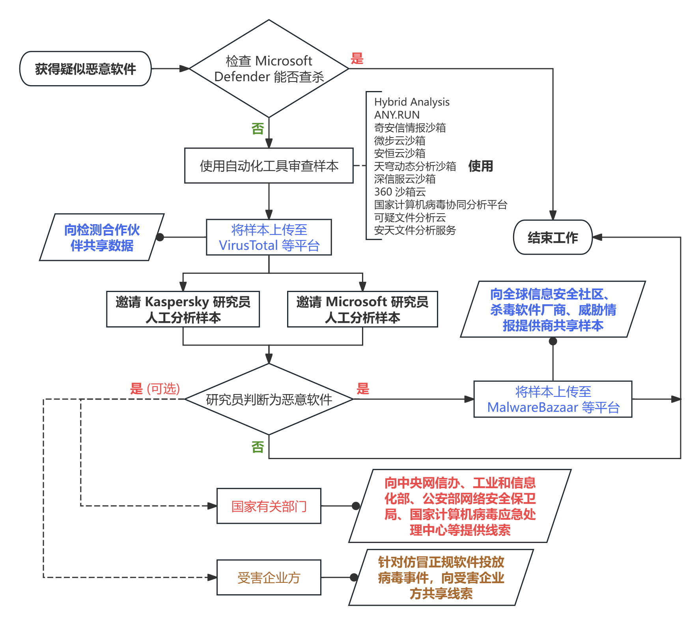

| &emsp;&emsp;&emsp;&emsp;&emsp;&emsp;&emsp;坚 持 筑 牢 国 家 网 络 安 全 屏 障&emsp;&emsp;&emsp;&emsp;&emsp;&emsp;&emsp; |
| :----------------------------------------------------------: |

| &emsp;&emsp;&emsp;&emsp;&emsp;&emsp;&emsp;没 有 网 络 安 全 就 没 有 国 家 安 全&emsp;&emsp;&emsp;&emsp;&emsp;&emsp;&emsp; |
| :----------------------------------------------------------: |

| &emsp;&emsp;&emsp;&emsp;&emsp;&emsp;&emsp;网 络 安 全 为 人 民&emsp;网 络 安 全 靠 人 民&emsp;&emsp;&emsp;&emsp;&emsp;&emsp;&emsp; |
| :----------------------------------------------------------: |

| &emsp;深 化 网 络 空 间 安 全 综 合 治 理&emsp;加 快 国 家 网 络 安 全 防 御 体 系 建 设&emsp; |
| :----------------------------------------------------------: |

 

<h1 align="center">灵糕中心 · 安全响应分中心</h1>

<h3 align="center">(LGHUB · Security Response Center)</h3>

[github.com/Lingggao/LGSRC](https://github.com/Lingggao/LGSRC) (GitHub)

&emsp;&emsp;**用于打击计算机病毒与恶意软件的 “[灵糕中心](https://github.com/Lingggao/LGHUB) · 安全响应分中心”**。由 2026 Microsoft Security Advisor (微软安全顾问) · [**Ling Gao**](https://github.com/Lingggao) 先生领导。灵糕中心 · 安全响应分中心创立于 2025 年 12 月 20 日。

> [!IMPORTANT]
>
> &emsp;灵糕中心为个人项目，管理者不是 Microsoft 公司员工，不能代表 Microsoft 公司立场、态度。

&emsp;&emsp;**宗旨**：独立管理、放眼全球、数据精确、打击迅速

---

Microsoft - [Microsoft 安全响应中心](https://msrc.microsoft.com) | [Microsoft 安全情报](https://www.microsoft.com/en-us/wdsi) | [Microsoft Defender 门户](https://security.microsoft.com) | [获取更新](https://www.microsoft.com/en-us/wdsi/defenderupdates) | [提交文件](https://www.microsoft.com/en-us/wdsi/filesubmission)

研究 - [微步云沙箱](https://s.threatbook.com) | [安天文件分析服务](https://fenxi.antiy.cn) | [安恒云沙箱](https://sandbox.dbappsecurity.com.cn) | [奇安信威胁情报中心](https://ti.qianxin.com) | [360 沙箱云](https://ata.360.net) | [天穹智能分析平台](https://sandbox.qianxin.com/sscc-tq-web) | [深信服威胁情报中心](https://ti.sangfor.com.cn/analysis-platform?lang=ZH-CN) | [国家计算机病毒协同分析平台 (国家计算机病毒应急处理中心)](http://110.41.132.165/#/entirety/upload) | [可疑文件分析云 (计算机病毒防御技术国家工程实验室)](https://cloud.vdnel.cn) | [VirusTotal](https://www.virustotal.com/gui/home/upload) | [MalwareBazaar](https://bazaar.abuse.ch) | [URLhaus](https://urlhaus.abuse.ch) | [Kaspersky OpenTIP](https://opentip.kaspersky.com) | [Hybrid Analysis](https://hybrid-analysis.com) | [ANY.RUN](https://app.any.run)

举报 - [中央网信办 违法和不良信息举报中心](https://www.12377.cn/index.html) | [网络违法犯罪信息举报网站](https://cyberpolice.mps.gov.cn/wfjb/#) | [网络不良与垃圾信息举报受理中心](https://www.12321.cn)

社区 - [卡饭论坛 病毒样本 分享&分析区](https://bbs.kafan.cn/forum-31-1.html) | [火绒安全论坛 病毒查杀问题反馈](https://bbs.huorong.cn/forum-44-1.html) | [百度贴吧 病毒吧](https://tieba.baidu.com/f?ie=utf-8&kw=%E7%97%85%E6%AF%92)

学习 - [Microsoft 认证：安全性、合规性和标识基础知识](https://learn.microsoft.com/zh-cn/credentials/certifications/security-compliance-and-identity-fundamentals) | [Microsoft 认证：安全运营分析师助理](https://learn.microsoft.com/zh-cn/credentials/certifications/security-operations-analyst) | [Microsoft 认证：网络安全架构师专家](https://learn.microsoft.com/zh-cn/credentials/certifications/cybersecurity-architect-expert) | [看雪学苑](https://www.kanxue.com) | [ISC.AI 学苑](https://study.360.net/frontend/home/home) | [阿里云 云安全高级工程师 ACP 认证](https://edu.aliyun.com/certification/acp04)

## 工作流程

**一、工作流程概述**

1. 发现 / 获得疑似恶意软件样本
2. 使用 Microsoft Defender (最新[安全智能](https://learn.microsoft.com/zh-cn/defender-endpoint/microsoft-defender-antivirus-updates)) 测试能否查杀
3. 如果不能，按工作流程开展前期研究
4. 请求 Microsoft 等公司研究员人工分析样本
5. 如果判断为恶意软件，则向全球信息安全社区、杀毒软件厂商、威胁情报提供商共享信息
6. (可选) 向国家有关部门提供线索
7. (可选) 针对仿冒正规软件投放病毒事件，向受害企业方共享线索
8. 将样本数据填写至下方表格

**二、满足以下任一条件时，样本数据不会填写至表格**

1. Microsoft Defender 可以查杀样本，无需人工分析
2. 经前期分析，可 100% 确认是正常文件
3. Microsoft 研究员判断样本干净 (Clean)
4. 样本首次发现日期距今已超过 30 天
5. 由其他从业人员 / 志愿者发现、分析、上报，本中心全程未参与

## 数据

&emsp;&emsp;上次更新时间：2026 年 3 月 16 日 1:00 (GMT+8)

&emsp;&emsp;**截至 2026 年 3 月 16 日，已打击计算机病毒 / 恶意软件 625 个、恶意网站 200 个**。

---

【**计算机病毒 / 恶意软件**】

> [!CAUTION]
>
> &emsp;为确保安全，本中心**不提供**病毒 / 恶意软件样本下载服务。

|   日期    |          文件名          |           检测           |                            SHA256                            |             Internal ID              |                          VirusTotal                          |                        MalwareBazaar                         | 编号 |
| :-------: | :----------------------: | :----------------------: | :----------------------------------------------------------: | :----------------------------------: | :----------------------------------------------------------: | :----------------------------------------------------------: | :--: |
| 2026/3/13 |    Chrome0155-x64.exe    |   **银狐 (SilverFox)**   | 7f6357d56682e097160491de0b58cc5ae32b3e549bcb979551c60dad843b7ca9 | 1470b4bd-c54d-41e5-8d66-5bf3efa64940 | [VirusTotal](https://www.virustotal.com/gui/file/7f6357d56682e097160491de0b58cc5ae32b3e549bcb979551c60dad843b7ca9) (27) | [MalwareBazaar Database](https://bazaar.abuse.ch/sample/7f6357d56682e097160491de0b58cc5ae32b3e549bcb979551c60dad843b7ca9) | A601 |
| 2026/3/13 |  电汇···银行方面···.exe  |   **银狐 (SilverFox)**   | 2405e493badb72b08eafafedd7a47255a3fa119df71a11a7a907cfd217841404 | 19cde1f2-6d66-4eac-b617-1532c1275480 | [VirusTotal](https://www.virustotal.com/gui/file/2405e493badb72b08eafafedd7a47255a3fa119df71a11a7a907cfd217841404) (14) | [MalwareBazaar Database](https://bazaar.abuse.ch/sample/2405e493badb72b08eafafedd7a47255a3fa119df71a11a7a907cfd217841404) | A602 |
| 2026/3/13 | 黑园区···身份信息···.exe | **银狐 (SilverFox.wos)** | 43b3eb69729a82c9babd44da03348659ba8c8f55afd6e8cb23ccae78eb09c890 | 86c7b4f8-15e7-404e-80f8-b84aec570de0 | [VirusTotal](https://www.virustotal.com/gui/file/43b3eb69729a82c9babd44da03348659ba8c8f55afd6e8cb23ccae78eb09c890) (13) | [MalwareBazaar Database](https://bazaar.abuse.ch/sample/43b3eb69729a82c9babd44da03348659ba8c8f55afd6e8cb23ccae78eb09c890) | A603 |
| 2026/3/14 |    Goge···GGSETUP.exe    |   **银狐 (SilverFox)**   | 76ae74bd4defb26ce9347111371516a02e2c0d559e41d6add65c6076a8bdc349 | d8d05e6f-5c5c-4d8d-9882-93effa8d3580 | [VirusTotal](https://www.virustotal.com/gui/file/76ae74bd4defb26ce9347111371516a02e2c0d559e41d6add65c6076a8bdc349) (15) | [MalwareBazaar Database](https://bazaar.abuse.ch/sample/76ae74bd4defb26ce9347111371516a02e2c0d559e41d6add65c6076a8bdc349) | A604 |
| 2026/3/14 |   Wps Office···win.exe   |  **Win32/Malgent!MSR**   | 482b58216798f728bb8a669645f8563210626f320a0c0f0aabd0dd350d871628 | 30f806d1-d1df-4003-8b11-acf309441810 | [VirusTotal](https://www.virustotal.com/gui/file/482b58216798f728bb8a669645f8563210626f320a0c0f0aabd0dd350d871628) (6) |                              无                              | A605 |
| 2026/3/14 |         WPS.msi          | **银狐 (SilverFox.cw)**  | c7bd726cbf743c593195ea0945907e9ee15d5c9ad7b7abbf69490fa34e7016dc | 1ceb397d-b23e-4ad2-aeab-9b9e1a8549b9 | [VirusTotal](https://www.virustotal.com/gui/file/c7bd726cbf743c593195ea0945907e9ee15d5c9ad7b7abbf69490fa34e7016dc) (17) |                              无                              | A606 |
| 2026/3/14 |   wps_Installer···.msi   |  **银狐 (SilverFox.l)**  | 32863ce083f952eca0219842f4c187ea418f82e42ff28650e711ad0d63046783 | 7230a2bc-1338-4db7-90c0-e200cdbb45d3 | [VirusTotal](https://www.virustotal.com/gui/file/32863ce083f952eca0219842f4c187ea418f82e42ff28650e711ad0d63046783) (7) |                              无                              | A607 |
| 2026/3/14 |      wps···HH1.msi       |  **银狐 (SilverFox.l)**  | 62d591cab5cb3532737e4449382cd77ab231da8e4b8c2225749eea8cea0baa57 | 7777a533-45cf-44d8-bd15-d564dcf1cc71 | [VirusTotal](https://www.virustotal.com/gui/file/62d591cab5cb3532737e4449382cd77ab231da8e4b8c2225749eea8cea0baa57) (10) |                              无                              | A608 |
| 2026/3/14 |   WpsSetup_office.exe    |  **Win32/Malgent!MSR**   | b07741be8853bf69e3da74a3bb66bc3242473ec399ac96e524f971467bea9284 | 3a15df4a-3b9e-4e87-94b9-547a17bd258c | [VirusTotal](https://www.virustotal.com/gui/file/b07741be8853bf69e3da74a3bb66bc3242473ec399ac96e524f971467bea9284) (16) | [MalwareBazaar Database](https://bazaar.abuse.ch/sample/b07741be8853bf69e3da74a3bb66bc3242473ec399ac96e524f971467bea9284) | A609 |
| 2026/3/14 |   opealeAi_7be···.exe    |   **银狐 (SilverFox)**   | c8fe0393370dd2bd85c1c85bae3815d5bf352961504710ca1e58b34b0ea71c11 | 37919466-cfe1-4161-a474-6392452f58c2 | [VirusTotal](https://www.virustotal.com/gui/file/c8fe0393370dd2bd85c1c85bae3815d5bf352961504710ca1e58b34b0ea71c11) (4) |                              无                              | A610 |
| 2026/3/14 |  ···external_Lrh···.exe  |        **Crypt**         | 877724c87d685b5ed6d0931222250fccad860c07b6262d038eeca94b603c42ca | a185046f-e5d7-4473-b97c-d6199fd0aa3f | [VirusTotal](https://www.virustotal.com/gui/file/877724c87d685b5ed6d0931222250fccad860c07b6262d038eeca94b603c42ca) (16) | [MalwareBazaar Database](https://bazaar.abuse.ch/sample/877724c87d685b5ed6d0931222250fccad860c07b6262d038eeca94b603c42ca) | A611 |
| 2026/3/14 |      Safew-Max.exe       |      **Cybercrime**      | 418afd03a98cfbdc9486b4aae25eba8ea4465c19572e7ce60663c27df50b65c9 | 3c1a686a-a436-4c8b-93c9-dd0dd4901c16 | [VirusTotal](https://www.virustotal.com/gui/file/418afd03a98cfbdc9486b4aae25eba8ea4465c19572e7ce60663c27df50b65c9) (5) | [MalwareBazaar Database](https://bazaar.abuse.ch/sample/418afd03a98cfbdc9486b4aae25eba8ea4465c19572e7ce60663c27df50b65c9) | A612 |
| 2026/3/14 |   Telegrom_sgs···.exe    |   **银狐 (SilverFox)**   | 602ba6cfeadbda1a3c4b37ac80d180292d4726d4bb154b2d0734f72d2a76aeaa | 384b2e16-9d1d-4286-aaa7-912125af4883 | [VirusTotal](https://www.virustotal.com/gui/file/602ba6cfeadbda1a3c4b37ac80d180292d4726d4bb154b2d0734f72d2a76aeaa) (4) |                              无                              | A613 |
| 2026/3/15 |         aes.exe          |  **Win64/Malgent!MSR**   | 606da9e8d627a1c95a90f876fcc465a741a1750a2c15cf4700f307f4ae108fe9 | aa744150-8f4b-4ea7-a1d8-23e3dc11f9ac | [VirusTotal](https://www.virustotal.com/gui/file/606da9e8d627a1c95a90f876fcc465a741a1750a2c15cf4700f307f4ae108fe9) (19) | [MalwareBazaar Database](https://bazaar.abuse.ch/sample/606da9e8d627a1c95a90f876fcc465a741a1750a2c15cf4700f307f4ae108fe9) | A614 |
| 2026/3/15 |         150.exe          | **银狐 (SilverFox.saf)** | 9c36c34fb6c1bd7af0f8c75ce999cb36a46b90789aca21d0a23167c1db468883 | 6ff29206-1119-4231-a23c-8b2eadb11b97 | [VirusTotal](https://www.virustotal.com/gui/file/9c36c34fb6c1bd7af0f8c75ce999cb36a46b90789aca21d0a23167c1db468883) (19) | [MalwareBazaar Database](https://bazaar.abuse.ch/sample/9c36c34fb6c1bd7af0f8c75ce999cb36a46b90789aca21d0a23167c1db468883) | A615 |
| 2026/3/15 |        test10.exe        |  **Win64/Malgent!MSR**   | a4ed49e3cc91c3856fd927ecaabdc1b99ef8541a111239f6a9ee6a65a271f74f | b9b26547-7c78-43b8-b649-7943b07b7ca8 | [VirusTotal](https://www.virustotal.com/gui/file/a4ed49e3cc91c3856fd927ecaabdc1b99ef8541a111239f6a9ee6a65a271f74f) (11) | [MalwareBazaar Database](https://bazaar.abuse.ch/sample/a4ed49e3cc91c3856fd927ecaabdc1b99ef8541a111239f6a9ee6a65a271f74f) | A616 |
| 2026/3/15 |   ChoneSetup···win.msi   |   **银狐 (SilverFox)**   | 2530025bd1fced9443a32079db97f9023a11968ec353f52adf73a8da0edd9daa | 3844cc65-3b6f-4d05-aa68-a6992ad78136 | [VirusTotal](https://www.virustotal.com/gui/file/2530025bd1fced9443a32079db97f9023a11968ec353f52adf73a8da0edd9daa) (21) | [MalwareBazaar Database](https://bazaar.abuse.ch/sample/2530025bd1fced9443a32079db97f9023a11968ec353f52adf73a8da0edd9daa) | A617 |
| 2026/3/15 |    Chrome333-x64.exe     |   **银狐 (SilverFox)**   | a777e1f816f6554cce97f5d71dc6814c30e6806ca6337ca04fd08f9e94b65e90 | 213803c2-fb3b-4c04-9692-5d1bba7a4f88 | [VirusTotal](https://www.virustotal.com/gui/file/a777e1f816f6554cce97f5d71dc6814c30e6806ca6337ca04fd08f9e94b65e90) (29) | [MalwareBazaar Database](https://bazaar.abuse.ch/sample/a777e1f816f6554cce97f5d71dc6814c30e6806ca6337ca04fd08f9e94b65e90) | A618 |
| 2026/3/15 |   goodgle-chome···.msi   |  **Win64/Malgent!MSR**   | 44ebe9b37b600f533b1d15e068829289251b85248752a213327236d2e4081493 | ca2b7e63-9300-45a0-a44b-4c0cffae526b | [VirusTotal](https://www.virustotal.com/gui/file/44ebe9b37b600f533b1d15e068829289251b85248752a213327236d2e4081493) (9) | [MalwareBazaar Database](https://bazaar.abuse.ch/sample/44ebe9b37b600f533b1d15e068829289251b85248752a213327236d2e4081493) | A619 |
| 2026/3/15 |   googlechr1.18···.msi   |   **银狐 (SilverFox)**   | d0655d9aa00a1e92b6b66ae9818b9e75234a515e550db729f6754443d5991324 | 4829b095-365c-48be-bf79-a96afaccde38 | [VirusTotal](https://www.virustotal.com/gui/file/d0655d9aa00a1e92b6b66ae9818b9e75234a515e550db729f6754443d5991324) (17) | [MalwareBazaar Database](https://bazaar.abuse.ch/sample/d0655d9aa00a1e92b6b66ae9818b9e75234a515e550db729f6754443d5991324) | A620 |
| 2026/3/15 |       YnA2FjA.zip        |   **银狐 (SilverFox)**   | e23585aefbb887977440af86195fe0ebf7763e10f2255217dbde7c1545de0a27 | dce0d68f-4775-405e-9319-4695942247c8 | [VirusTotal](https://www.virustotal.com/gui/file/e23585aefbb887977440af86195fe0ebf7763e10f2255217dbde7c1545de0a27) (4) | [MalwareBazaar Database](https://bazaar.abuse.ch/sample/e23585aefbb887977440af86195fe0ebf7763e10f2255217dbde7c1545de0a27) | A621 |
| 2026/3/15 |       LetsVPN.exe        |   **银狐 (SilverFox)**   | 8f4140708cdf0fe3b39a055c4d55539e3e46202eb684f723855d34150783f73c | b988cc0a-a891-4b7d-99ca-5a254c907fec | [VirusTotal](https://www.virustotal.com/gui/file/8f4140708cdf0fe3b39a055c4d55539e3e46202eb684f723855d34150783f73c) (3) |                              无                              | A622 |
| 2026/3/15 |    WPS_Setup-unui.exe    |      **Cybercrime**      | 16fe8aaf86bc90b885dd8de046ad0c63d701bd24994e2358465ada973f77f0ea |                                      | [VirusTotal](https://www.virustotal.com/gui/file/16fe8aaf86bc90b885dd8de046ad0c63d701bd24994e2358465ada973f77f0ea) (2) |                              无                              | A623 |
| 2026/3/15 |   WPSoffice···2192.exe   |   **银狐 (SilverFox)**   | cdb22eef3c6ca456de12db3346833f7a8a97fa74bfe63b3bb9a2550278ec5a66 |                                      | [VirusTotal](https://www.virustotal.com/gui/file/cdb22eef3c6ca456de12db3346833f7a8a97fa74bfe63b3bb9a2550278ec5a66) (5) |                              无                              | A624 |
| 2026/3/15 |    通道账单错误b.exe     |         **XRed**         | 9b2dd6b539336506d71d98f840e902cdf0f60b1cabf3d163a725453a8eb97aca |                                      | [VirusTotal](https://www.virustotal.com/gui/file/9b2dd6b539336506d71d98f840e902cdf0f60b1cabf3d163a725453a8eb97aca) (62) | [MalwareBazaar Database](https://bazaar.abuse.ch/sample/9b2dd6b539336506d71d98f840e902cdf0f60b1cabf3d163a725453a8eb97aca) | A625 |
|  ——————   |       ————————————       |       ————————————       |             ———————————————————————————————————              |         ————————————————————         |                           ————————                           |                         ————————————                         | ———  |

> [!NOTE]
>
> &emsp;只显示最近约 30 条数据，更早数据详见 LGSRC/[Archive_1.md](https://github.com/Lingggao/LGSRC/blob/main/Archive_1.md) (计算机病毒 / 恶意软件归档)。

---

【**恶意网站**】

> [!CAUTION]
>
> &emsp;为确保安全，网站地址将用 “hxxps://” 与 “[.]” 进行替换。**切勿尝试访问表格中列出的任何网址**。

|   日期    |                    URL                     |          类别          |                           有效载荷                           |                         URLhaus                          | 编号 |
| :-------: | :----------------------------------------: | :--------------------: | :----------------------------------------------------------: | :------------------------------------------------------: | :--: |
| 2026/3/5  |       hxxps://zh-cn-google[.]hl[.]cn       | 仿冒 Chrome、传播病毒  |           hxxps://tenyunat-99viplawt[.]com/QQGSYLX           | [URLhaus Database](https://urlhaus.abuse.ch/url/3790137) | Z178 |
| 2026/3/6  |           hxxps://kdocs-cn[.]com           | 仿冒金山文档、传播病毒 |     hxxps://down[.]wps-kdocs[.]com/jinshandocs-x86[.]zip     | [URLhaus Database](https://urlhaus.abuse.ch/url/3790481) | Z179 |
| 2026/3/7  |        hxxps://www[.]huoronga[.]com        |   仿冒火绒、传播病毒   | hxxps://pub-826b2258a9f74a40abe9ee543f2409a4[.]r2[.]dev/3[.]600Hnevsak[.]zip | [URLhaus Database](https://urlhaus.abuse.ch/url/3791281) | Z180 |
| 2026/3/7  |   hxxps://hnieodfnoibgnuiowwirodnm[.]com   |   仿冒火绒、传播病毒   | hxxps://pub-826b2258a9f74a40abe9ee543f2409a4[.]r2[.]dev/3[.]600Hnevsak[.]zip | [URLhaus Database](https://urlhaus.abuse.ch/url/3791281) | Z181 |
| 2026/3/7  |         hxxps://lk-wps[.]com[.]cn          |   仿冒 WPS、传播病毒   |       hxxps://www[.]irbis2000[.]com/WPS_Setup64[.]exe        | [URLhaus Database](https://urlhaus.abuse.ch/url/3791536) | Z182 |
| 2026/3/9  |       hxxps://zh-cn-google[.]hl[.]cn       | 仿冒 Chrome、传播病毒  |           hxxps://tenyunat-99viplawt[.]com/QQGSYLX           |                            无                            | Z183 |
| 2026/3/9  |     hxxps://chrroome-google[.]hl[.]cn      | 仿冒 Chrome、传播病毒  | hxxps://www[.]upclouds[.]world/?c=uRrMbiqnQzpXGOE69R5LpRLFN9WsRMGBtn8tmwafDNl3hN2DWS4UNjejTxnBRVb4 |                            无                            | Z184 |
| 2026/3/9  |  hxxps://google-google-google[.]com[.]cn   | 仿冒 Chrome、传播病毒  |                              无                              |                            无                            | Z185 |
| 2026/3/9  |         hxxps://im-wps[.]com[.]cn          |   仿冒 WPS、传播病毒   | hxxps://www[.]asdfgsdfgxcvbvcxasd-oss[.]top/WpsOffice_x64%20_v10_win888[.]zip | [URLhaus Database](https://urlhaus.abuse.ch/url/3792813) | Z186 |
| 2026/3/11 |       hxxps://ai-openclaw[.]com[.]cn       |  仿冒 OpenClaw “龙虾”  | hxxps://www[.]nmysq[.]top/oss/usha/ope/openclawAI%207beAolenc[.]zip | [URLhaus Database](https://urlhaus.abuse.ch/url/3794716) | Z187 |
| 2026/3/14 |         hxxps://aps-wps[.]com[.]cn         |   仿冒 WPS、传播病毒   |  hxxps://mapt[.]oss-cn-hongkong[.]aliyuncs[.]com/WPS[.]zip   |                            无                            | Z188 |
| 2026/3/14 |         hxxps://iin-wps[.]com[.]cn         |   仿冒 WPS、传播病毒   | hxxps://www[.]aliyunnorth-oss[.]top/Wps%20Office_x64_%20v1[.]0_win[.]zip | [URLhaus Database](https://urlhaus.abuse.ch/url/3795617) | Z189 |
| 2026/3/14 |         hxxps://lk-wps[.]com[.]cn          |   仿冒 WPS、传播病毒   | hxxps://wps10[.]oss-cn-hongkong[.]aliyuncs[.]com/wps_Installer_Setup_HH[.]zip |                            无                            | Z190 |
| 2026/3/14 |         hxxps://pw-wps[.]com[.]cn          |   仿冒 WPS、传播病毒   | hxxps://wps04[.]oss-cn-hongkong[.]aliyuncs[.]com/wps_Installer_Setup_HH[.]zip |                            无                            | Z191 |
| 2026/3/14 |          hxxps://ps-wps[.]hl[.]cn          |   仿冒 WPS、传播病毒   | hxxps://download[.]xiaodiqiyi[.]com/WPS%20Office%20Setup[.]zip |                            无                            | Z192 |
| 2026/3/14 |   hxxps://www[.]web-openclaw[.]com[.]cn    |  仿冒 OpenClaw “龙虾”  |   hxxps://www[.]web-openclaw[.]com[.]cn/pc/openclaw[.]zip    |                            无                            | Z193 |
| 2026/3/15 |    hxxps://cn-google-google[.]com[.]cn     | 仿冒 Chrome、传播病毒  | hxxps://bf-chromefdghd[.]oss-cn-hongkong[.]aliyuncs[.]com/bf-chrome-03-12-01[.]zip | [URLhaus Database](https://urlhaus.abuse.ch/url/3796607) | Z194 |
| 2026/3/15 |  hxxps://cn[.]cn-chhrome-google[.]hl[.]cn  | 仿冒 Chrome、传播病毒  | hxxps://download[.]google-chrome[.]cyou/downloads/chrome[.]php | [URLhaus Database](https://urlhaus.abuse.ch/url/3796599) | Z195 |
| 2026/3/15 |    hxxps://zh[.]cn-google-zh[.]hl[.]cn     | 仿冒 Chrome、传播病毒  | hxxps://sgnfyn[.]oss-cn-shenzhen[.]aliyuncs[.]com/goodgle-chomex16[.]83[.]zip | [URLhaus Database](https://urlhaus.abuse.ch/url/3796605) | Z196 |
| 2026/3/15 | hxxps://www[.]zhcn-google-chrome[.]hl[.]cn | 仿冒 Chrome、传播病毒  | hxxps://download[.]google-chrome[.]cyou/downloads/chrome[.]php | [URLhaus Database](https://urlhaus.abuse.ch/url/3796599) | Z197 |
| 2026/3/15 |   hxxps://zh[.]support-google[.]hl[.]cn    | 仿冒 Chrome、传播病毒  | hxxps://sgnfyn[.]oss-cn-shenzhen[.]aliyuncs[.]com/googlechr1[.]18[.]9[.]83[.]zip | [URLhaus Database](https://urlhaus.abuse.ch/url/3796606) | Z198 |
| 2026/3/15 |       hxxps://zh-cn-google[.]hl[.]cn       | 仿冒 Chrome、传播病毒  |           hxxps://tenyunat-99viplawt[.]com/QQGSYLX           |                            无                            | Z199 |
| 2026/3/15 |     hxxps://cn[.]google-zhcn[.]hl[.]cn     | 仿冒 Chrome、传播病毒  | hxxps://sgnfyn[.]oss-cn-shenzhen[.]aliyuncs[.]com/goodgle-chomex16[.]83[.]zip | [URLhaus Database](https://urlhaus.abuse.ch/url/3796605) | Z200 |
|  ——————   |            ————————————————————            |    ———————————————     |                ——————————————————————————————                |                        ——————————                        | ———  |

> [!NOTE]
>
> &emsp;只显示最近约 30 条数据，更早数据详见 LGSRC/[Archive_2.md](https://github.com/Lingggao/LGSRC/blob/main/Archive_2.md) (恶意网站归档)。

## 如何提交文件进行分析？

&emsp;&emsp;用户可通过 [Submit a file for malware analysis](https://www.microsoft.com/en-us/wdsi/filesubmission) 平台向 Microsoft 公司提交可疑文件以供分析。

&emsp;&emsp;如需联系 Ling Gao 共享信息，请发送电子邮件至 **Ling@LGHUB.org**。谢谢！😀

---

[回到顶部](#HEAD)

  

在 “[署名 - 相同方式共享 4.0](https://creativecommons.org/licenses/by-sa/4.0/legalcode.zh-Hans)” (CC BY-SA 4.0) 协议之条款下提供。

2025 - 2026, [Ling Gao](https://github.com/Lingggao), 灵糕中心 · 安全响应分中心, [github.com/Lingggao/LGSRC](https://github.com/Lingggao/LGSRC)

[字体许可使用授权书](https://github.com/Lingggao/LGSRC/blob/main/Images/%E5%AD%97%E4%BD%93%E8%AE%B8%E5%8F%AF%E4%BD%BF%E7%94%A8%E6%8E%88%E6%9D%83%E4%B9%A6.png?raw=true) | [Windows Insider 最有价值专家](https://github.com/Lingggao/LGSRC/blob/main/Images/Windows%20Insider%20MVP.png?raw=true)