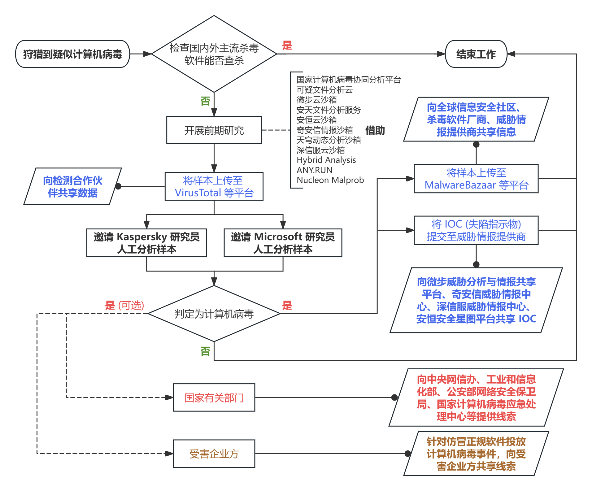

| &emsp;&emsp;&emsp;&emsp;&emsp;&emsp;&emsp;坚 持 筑 牢 国 家 网 络 安 全 屏 障&emsp;&emsp;&emsp;&emsp;&emsp;&emsp;&emsp; |
| :----------------------------------------------------------: |

| &emsp;&emsp;&emsp;&emsp;&emsp;&emsp;&emsp;没 有 网 络 安 全 就 没 有 国 家 安 全&emsp;&emsp;&emsp;&emsp;&emsp;&emsp;&emsp; |
| :----------------------------------------------------------: |

| &emsp;&emsp;&emsp;&emsp;&emsp;&emsp;&emsp;网 络 安 全 为 人 民&emsp;网 络 安 全 靠 人 民&emsp;&emsp;&emsp;&emsp;&emsp;&emsp;&emsp; |
| :----------------------------------------------------------: |

| &emsp;深 化 网 络 空 间 安 全 综 合 治 理&emsp;加 快 国 家 网 络 安 全 防 御 体 系 建 设&emsp; |
| :----------------------------------------------------------: |

<h1 align="center">灵糕中心 · 安全响应中心</h1>

<h3 align="center">Linggao Hub · Security Response Center (LGSRC)</h3>

[www.lgsrc.cn](https://www.lgsrc.cn) (门户) & [github.com/Lingggao/LGSRC](https://github.com/Lingggao/LGSRC) (GitHub)

&emsp;&emsp;**用于打击计算机病毒与恶意软件的 “[灵糕中心](https://github.com/Lingggao/LGHUB) · 安全响应中心”**。由独立网络安全研究员、中国计算机学会 (CCF) 会员兼计算机安全专业委员会委员 [**Ling Gao**](https://github.com/Lingggao/LGSRC/blob/main/Documents/Leadership.md) 领导。灵糕中心 · 安全响应中心创立于 2025 年 12 月 20 日。

> [!IMPORTANT]
>
> &emsp;灵糕中心为独立非营利组织，与其他企业不构成隶属、雇佣、代理等关系。

&emsp;&emsp;**宗旨**：独立管理、放眼全国、数据精确、打击迅速

---

研究 - [国家计算机病毒协同分析平台 (国家计算机病毒应急处理中心)](https://virus.cverc.org.cn) | [可疑文件分析云 (计算机病毒防御技术国家工程实验室)](https://cloud.vdnel.cn) | [微步云沙箱](https://s.threatbook.com) | [安天文件分析服务](https://fenxi.antiy.cn) | [安恒云沙箱](https://sandbox.dbappsecurity.com.cn) | [奇安信威胁情报中心](https://ti.qianxin.com) | [天穹智能分析平台](https://sandbox.qianxin.com/sscc-tq-web) | [深信服威胁情报中心](https://ti.sangfor.com.cn/analysis-platform?lang=ZH-CN) | [VirusTotal](https://www.virustotal.com) | [MalwareBazaar](https://bazaar.abuse.ch) | [URLhaus](https://urlhaus.abuse.ch) | [Kaspersky OpenTIP](https://opentip.kaspersky.com) | [Microsoft 安全情报](https://www.microsoft.com/en-us/wdsi) | [Hybrid Analysis](https://hybrid-analysis.com) | [ANY.RUN](https://app.any.run)

举报 - [中央网信办 违法和不良信息举报中心](https://www.12377.cn/index.html) | [网络违法犯罪信息举报网站](https://cyberpolice.mps.gov.cn/wfjb/#) | [网络不良与垃圾信息举报受理中心](https://www.12321.cn)

社区 - [卡饭论坛 病毒样本 分享&分析区](https://bbs.kafan.cn/forum-31-1.html) | [火绒安全论坛 病毒查杀问题反馈](https://bbs.huorong.cn/forum-44-1.html) | [百度贴吧 病毒吧](https://tieba.baidu.com/f?ie=utf-8&kw=%E7%97%85%E6%AF%92)

学习 - [看雪学苑](https://www.kanxue.com) | [ISC.AI 学苑](https://study.360.net/frontend/home/home) | [阿里云 云安全高级工程师 ACP 认证](https://edu.aliyun.com/certification/acp04) | [Microsoft 认证：网络安全架构师专家](https://learn.microsoft.com/zh-cn/credentials/certifications/cybersecurity-architect-expert)

## 工作流程

**一、工作流程概述**

1. 发现 / 获得疑似恶意软件样本
2. 测试国内外主流杀毒软件 (最新反病毒数据库) 能否查杀
3. 如果不能，借助自动化工具开展前期研究
4. 邀请 Microsoft 与 Kaspersky 安全研究员人工分析样本
5. 如果确认为恶意软件，向全球信息安全社区、杀毒软件厂商、威胁情报提供商共享信息
6. (可选) 向国家有关部门提供线索
7. (可选) 针对仿冒正规软件投放病毒事件，向受害企业方共享线索
8. 将样本数据填写至下方表格

**二、满足以下任一条件时，样本数据不会填写至表格**

1. 多数杀毒软件可以查杀样本，无需人工分析
2. 经前期分析，可 100% 确认为正常文件
3. Microsoft 与 Kaspersky 安全研究员判断样本安全
4. 样本首次发现日期距今已超过 30 天
5. 由其他从业人员 / 志愿者发现、分析、上报，本中心全程未参与

## 数据

&emsp;&emsp;上次更新时间：2026 年 6 月 19 日 19:00 (GMT+8)

&emsp;&emsp;**截至 2026 年 6 月 19 日，本中心已打击计算机病毒 / 恶意软件 1299 个、恶意网站 605 个，累计为潜在受害者规避经济损失约 5,520,750 元人民币**。[ $$E = \sum (W_i \times P_{\text{exec}} \times N_{\text{victim}} \times P_{\text{monetize}} \times V_{\text{loss}})$$ ] ([何意味？](https://github.com/Lingggao/LGSRC/blob/main/Documents/LossModel.md))

&emsp;&emsp;在对抗网络犯罪的崇高事业中，本中心仅承担了少量协调类工作。**恶意载荷从发现到清除，离不开国家有关部门、安全社区与研究员、杀毒软件厂商及威胁情报提供商的共同努力**。在此，谨向他们致以诚挚谢意。

&emsp;&emsp;**本中心每打击 1 个计算机病毒、恶意软件或恶意网站，将同步向[联合国儿童基金会](https://www.unicef.org/zh) “爱心为救灾” 计划捐赠 1 元人民币**。该计划旨在支持中国及其他国家实现可持续发展目标，特别是为困境儿童提供援助。

---

【**计算机病毒 / 恶意软件**】

> [!CAUTION]
>
> &emsp;为确保安全，本中心**不提供**计算机病毒 / 恶意软件样本下载服务。

|   日期    |         文件名          |           检测           |                            SHA256                            |             Internal ID              |                          VirusTotal                          |                        MalwareBazaar                         | 编号 |
| :-------: | :---------------------: | :----------------------: | :----------------------------------------------------------: | :----------------------------------: | :----------------------------------------------------------: | :----------------------------------------------------------: | :--: |
| 2026/6/16 | ainstdownt65561014.exe  | **银狐 (SilverFox.bm)**  | 9b1250b299fdb88e3ba6b9b3084851b9bcaffdeb202a85b02d20cd9a761af21e | e30a7e66-3d38-4c2f-9f1c-a883bb3e20f2 | [VirusTotal](https://www.virustotal.com/gui/file/9b1250b299fdb88e3ba6b9b3084851b9bcaffdeb202a85b02d20cd9a761af21e) (12) | [MalwareBazaar Database](https://bazaar.abuse.ch/sample/9b1250b299fdb88e3ba6b9b3084851b9bcaffdeb202a85b02d20cd9a761af21e) | 1280 |
| 2026/6/16 |    WeGameMini···.exe    |   **银狐 (SilverFox)**   | dfd3f78b3313a33136b499ec4c74594376b83c9df882a410c95a6f41d42f41bb | bc3c22da-7718-4711-b662-bfe5fe2d4e8c | [VirusTotal](https://www.virustotal.com/gui/file/dfd3f78b3313a33136b499ec4c74594376b83c9df882a410c95a6f41d42f41bb) (21) | [MalwareBazaar Database](https://bazaar.abuse.ch/sample/dfd3f78b3313a33136b499ec4c74594376b83c9df882a410c95a6f41d42f41bb) | 1281 |
| 2026/6/16 |  ainstdown65561009.msi  |   **银狐 (SilverFox)**   | a187330553873191cd11b2823ce9fcee6ba0eae1c31ecb2aace7fecf5280c46c | e1682139-aa02-4b8c-9cb5-6581cde67bb7 | [VirusTotal](https://www.virustotal.com/gui/file/a187330553873191cd11b2823ce9fcee6ba0eae1c31ecb2aace7fecf5280c46c) (10) | [MalwareBazaar Database](https://bazaar.abuse.ch/sample/a187330553873191cd11b2823ce9fcee6ba0eae1c31ecb2aace7fecf5280c46c) | 1282 |
| 2026/6/16 |  ainstdown65561002.msi  |   **银狐 (SilverFox)**   | 6f01bc9e92bbf3271bd6e1b113d96a424144cb8fc4584d7f9a2ebff55f49af6a | 58c72977-9396-4586-ac39-7683f9bcd3d0 | [VirusTotal](https://www.virustotal.com/gui/file/6f01bc9e92bbf3271bd6e1b113d96a424144cb8fc4584d7f9a2ebff55f49af6a) (7) | [MalwareBazaar Database](https://bazaar.abuse.ch/sample/6f01bc9e92bbf3271bd6e1b113d96a424144cb8fc4584d7f9a2ebff55f49af6a) | 1283 |
| 2026/6/16 |   qudongjingling7.msi   |      **Cybercrime**      | d85e899a11ee9ad7841595cba5a66ec7a4c71046ced35510019fd52dd2ba3fcd | bd184eb9-dba5-4a91-ad35-7628fb2d3e08 | [VirusTotal](https://www.virustotal.com/gui/file/d85e899a11ee9ad7841595cba5a66ec7a4c71046ced35510019fd52dd2ba3fcd) (26) |                              无                              | 1284 |
| 2026/6/17 | ainstaller-8653h003.exe | **银狐 (SilverFox.bm)**  | 2542cff54a238a232c25b23ae3fdec02ee6919c9070f2258b0ac6be2662b7a14 | 263fdb55-a5b9-4175-9895-0033e04bb7a9 | [VirusTotal](https://www.virustotal.com/gui/file/2542cff54a238a232c25b23ae3fdec02ee6919c9070f2258b0ac6be2662b7a14) (14) | [MalwareBazaar Database](https://bazaar.abuse.ch/sample/2542cff54a238a232c25b23ae3fdec02ee6919c9070f2258b0ac6be2662b7a14) | 1285 |
| 2026/6/17 |   bandizip···0616.exe   | **银狐 (SilverFox.sa)**  | 7e27deea413f5c390fd790423de9dc552a1e393187607485394044c4ddc85fdf | 6b027742-32ed-49cf-9bdb-b1597374b5cb | [VirusTotal](https://www.virustotal.com/gui/file/7e27deea413f5c390fd790423de9dc552a1e393187607485394044c4ddc85fdf) (2) | [MalwareBazaar Database](https://bazaar.abuse.ch/sample/7e27deea413f5c390fd790423de9dc552a1e393187607485394044c4ddc85fdf) | 1286 |
| 2026/6/17 |      Launcher.exe       | **银狐 (SilverFox.wos)** | 9ab135ec9d97c65caacdc2cd1ac166b7f491d8ad0635b3bd595a244ca6af9795 | 77911614-be87-4ef8-be97-56a4ddeece92 | [VirusTotal](https://www.virustotal.com/gui/file/9ab135ec9d97c65caacdc2cd1ac166b7f491d8ad0635b3bd595a244ca6af9795) (14) | [MalwareBazaar Database](https://bazaar.abuse.ch/sample/9ab135ec9d97c65caacdc2cd1ac166b7f491d8ad0635b3bd595a244ca6af9795) | 1287 |
| 2026/6/17 |  SogouExplorer···.exe   |   **银狐 (SilverFox)**   | 6265b9b7d5599d63422c0ca9eaccdf6a1d14f51736e4c5efb4f4bbbb43f10514 | 651ea9ac-5634-44ff-8694-d706da86b5da | [VirusTotal](https://www.virustotal.com/gui/file/6265b9b7d5599d63422c0ca9eaccdf6a1d14f51736e4c5efb4f4bbbb43f10514) (6) |                              无                              | 1288 |
| 2026/6/17 | ···Telegram.ZcJnu7.exe  |   **银狐 (SilverFox)**   | 8832671c0ad8176d68b7caa9ff40f6313b3cbe85240617311f015c7d641ec4bf | 21c0b286-fa4c-492d-a77f-b84f0fe7f12e | [VirusTotal](https://www.virustotal.com/gui/file/8832671c0ad8176d68b7caa9ff40f6313b3cbe85240617311f015c7d641ec4bf) (4) |                              无                              | 1289 |
| 2026/6/18 |  ainstaller···3012.exe  | **银狐 (SilverFox.bm)**  | 82218c4065f73f6b07220b8dcb9185c0669f193ecfc3ee75fc8b36e72abfbdde | 06b2b255-7de0-4ea6-bdab-bcafcefe1ddb | [VirusTotal](https://www.virustotal.com/gui/file/82218c4065f73f6b07220b8dcb9185c0669f193ecfc3ee75fc8b36e72abfbdde) (17) | [MalwareBazaar Database](https://bazaar.abuse.ch/sample/82218c4065f73f6b07220b8dcb9185c0669f193ecfc3ee75fc8b36e72abfbdde) | 1290 |
| 2026/6/18 |    Quark···0616.exe     | **银狐 (SilverFox.sa)**  | 1a2312f2bace5d7c64adfc28dba89360fbdde0d680ba785cfb5a3ef4ad169764 | 41487f1b-ddb6-4323-bb47-c9c5b977329e | [VirusTotal](https://www.virustotal.com/gui/file/1a2312f2bace5d7c64adfc28dba89360fbdde0d680ba785cfb5a3ef4ad169764) (3) |                              无                              | 1291 |
| 2026/6/18 |   quarkPC···6.857.exe   |   **银狐 (SilverFox)**   | 0fb2a4a9e5a714b605354bc6e59a6b1f23b94e3743dbc1fb9f86799450d27fbe | a8fbafeb-79b3-486e-8bf4-19c4034e7eed | [VirusTotal](https://www.virustotal.com/gui/file/0fb2a4a9e5a714b605354bc6e59a6b1f23b94e3743dbc1fb9f86799450d27fbe) (10) | [MalwareBazaar Database](https://bazaar.abuse.ch/sample/0fb2a4a9e5a714b605354bc6e59a6b1f23b94e3743dbc1fb9f86799450d27fbe) | 1292 |
| 2026/6/18 | WPS_Office_36859···.exe |   **银狐 (SilverFox)**   | 006aa1b94748e09cdbbf1db9a07b87b52e2689553843384dd1808383c13601a0 | ff5413f9-c278-4326-92e5-5d391cbb735e | [VirusTotal](https://www.virustotal.com/gui/file/006aa1b94748e09cdbbf1db9a07b87b52e2689553843384dd1808383c13601a0) (4) |                              无                              | 1293 |
| 2026/6/18 |      explorer.exe       | **银狐 (SilverFox.sa)**  | 77e89f5a5e5d40bff8894fa36ab166e2ce699cfd4ad263f1db2e229764f53206 | 1af7e758-2add-4de9-aeec-2f919e08009a | [VirusTotal](https://www.virustotal.com/gui/file/77e89f5a5e5d40bff8894fa36ab166e2ce699cfd4ad263f1db2e229764f53206) (6) | [MalwareBazaar Database](https://bazaar.abuse.ch/sample/77e89f5a5e5d40bff8894fa36ab166e2ce699cfd4ad263f1db2e229764f53206) | 1294 |
| 2026/6/18 | 6.17裁员名单···pdf.exe  | **银狐 (SilverFox.bg)**  | 5f63a3d786af6fe7edc91b6c9f2734eff3e0959302c2717f1268764ac13a89f0 | 91da8a82-ca8f-4b38-b7bb-740cfc661f50 | [VirusTotal](https://www.virustotal.com/gui/file/5f63a3d786af6fe7edc91b6c9f2734eff3e0959302c2717f1268764ac13a89f0) (12) | [MalwareBazaar Database](https://bazaar.abuse.ch/sample/5f63a3d786af6fe7edc91b6c9f2734eff3e0959302c2717f1268764ac13a89f0) | 1295 |
| 2026/6/18 |   feiniaoSetupX64.exe   |   **银狐 (SilverFox)**   | 8a60ea77b0b5795015c4e01d8f39bc2fb103861a03a9c61570f6052753d4344d | d6262cd8-4f36-4ed9-94d0-1efaae1451f3 | [VirusTotal](https://www.virustotal.com/gui/file/8a60ea77b0b5795015c4e01d8f39bc2fb103861a03a9c61570f6052753d4344d) (6) |                              无                              | 1296 |
| 2026/6/19 | ainstaller-86533012.exe | **银狐 (SilverFox.bm)**  | b37ebc9801fbd25c66d48bf254b94044c24952eaed80747bde1828d85a10f167 | f7466293-67af-4644-9bd3-0ea9720db9f3 | [VirusTotal](https://www.virustotal.com/gui/file/b37ebc9801fbd25c66d48bf254b94044c24952eaed80747bde1828d85a10f167) (26) | [MalwareBazaar Database](https://bazaar.abuse.ch/sample/b37ebc9801fbd25c66d48bf254b94044c24952eaed80747bde1828d85a10f167) | 1297 |
| 2026/6/19 |   sogouliulanqi7.msi    |      **Cybercrime**      | 3b94f2e12ee3c8308c262d3da4bfeb95d0aa7d9934c576bba3ac234f4905a6e9 | 6655a89f-1590-4b69-b18d-906cf70bcc3c | [VirusTotal](https://www.virustotal.com/gui/file/3b94f2e12ee3c8308c262d3da4bfeb95d0aa7d9934c576bba3ac234f4905a6e9) (18) |                              无                              | 1298 |
| 2026/6/19 |   sys_HR···EANej.exe    |   **银狐 (SilverFox)**   | 19a17633e7c7d1c0cc58162c3faedffe3bc77a17c104277400c7b68ca9168fbd | dd65cbae-801f-4b9b-afe7-823ae361905b | [VirusTotal](https://www.virustotal.com/gui/file/19a17633e7c7d1c0cc58162c3faedffe3bc77a17c104277400c7b68ca9168fbd) (17) |                              无                              | 1299 |
|  ——————   |      ————————————       |       ————————————       |             ———————————————————————————————————              |         ————————————————————         |                           ————————                           |                         ————————————                         | ———  |

> [!NOTE]
>
> &emsp;只显示最近约 20 条数据，更早数据详见 LGSRC/[Archive_1.md](https://github.com/Lingggao/LGSRC/blob/main/Archive_1.md) (计算机病毒 / 恶意软件归档)。

---

【**恶意网站**】

> [!CAUTION]
>
> &emsp;为确保安全，网站地址将用 “hxxps://” 与 “[.]” 进行替换。**切勿尝试访问表格中列出的任何网址**。

|   日期    |                 URL                  |              类别              |                           有效载荷                           |  URLhaus   | 编号 |
| :-------: | :----------------------------------: | :----------------------------: | :----------------------------------------------------------: | :--------: | :--: |
| 2026/6/16 |    hxxps://ai-jingling[.]com[.]cn    |   **仿冒驱动精灵、传播病毒**   |                           同 Z575                            |     无     | Z586 |
| 2026/6/17 |   hxxps://apps-anydesk[.]com[.]cn    |   **仿冒 AnyDesk、传播病毒**   | hxxps://www[.]weurhgbakbvs-oss[.]top/anydesk_v1[.]1_x64_win[.]zip |     无     | Z587 |
| 2026/6/17 |    hxxps://en-anydesk[.]com[.]cn     |        **仿冒 AnyDesk**        |                              无                              |     无     | Z588 |
| 2026/6/17 |     hxxps://aanydesk[.]com[.]cn      |        **仿冒 AnyDesk**        |                              无                              |     无     | Z589 |
| 2026/6/17 |  hxxps://web-2345browser[.]com[.]cn  | **仿冒 2345 浏览器、传播病毒** |            hxxps://www[.]velnix703[.]com/downs245            |     无     | Z590 |
| 2026/6/18 |     hxxps://uc-quark[.]com[.]cn      |     **仿冒夸克、传播病毒**     | hxxps://download-dowon-firefox[.]com[.]cn/donwnload/Quark_win_6[.]8[.]0[.]802[.]zip |     无     | Z591 |
| 2026/6/18 |     hxxps://en-quark[.]com[.]cn      |     **仿冒夸克、传播病毒**     |                           同 Z591                            |     无     | Z592 |
| 2026/6/18 | hxxps://www[.]quark-drive[.]hl[.]cn  |     **仿冒夸克、传播病毒**     | hxxps://mypornomovies[.]com/down[.]php/264dbf2a579f59cc6249eb0153ad2ea8[.]zip |     无     | Z593 |
| 2026/6/18 |      hxxps://cn-quark[.]hl[.]cn      |     **仿冒夸克、传播病毒**     |                   hxxps://dl[.]tpn2n[.]com                   |     无     | Z594 |
| 2026/6/18 |   hxxps://browser-quark[.]hl[.]cn    |     **仿冒夸克、传播病毒**     |            hxxps://www[.]velnix703[.]com/downs245            |     无     | Z595 |
| 2026/6/18 | hxxps://www[.]kuake-wpan[.]com[.]cn  |     **仿冒夸克、传播病毒**     |                           同 Z595                            |     无     | Z596 |
| 2026/6/18 |       hxxps://wps-editor[.]com       |     **仿冒 WPS、传播病毒**     | hxxps://bddownload[.]oss-cn-hongkong[.]aliyuncs[.]com/x64_WPS_Office_36859_Setup[.]zip |     无     | Z597 |
| 2026/6/18 |    hxxps://www[.]wpsws[.]com[.]cn    |     **仿冒 WPS、传播病毒**     | hxxps://download[.]xu619[.]top/wps_wid[.]cid-457274487_patched[.]zip |     无     | Z598 |
| 2026/6/19 |     hxxps://ca-canva[.]com[.]cn      | **仿冒 Canva 可画、传播病毒**  |             hxxps://www[.]hed6g8u[.]com/installd             |     无     | Z599 |
| 2026/6/19 |     hxxps://hk-canva[.]com[.]cn      | **仿冒 Canva 可画、传播病毒**  |                           同 Z599                            |     无     | Z600 |
| 2026/6/19 | hxxps://www[.]hed6g8u[.]com/installd |        **传播银狐病毒**        |                       有，载荷提取失败                       |     无     | Z601 |
| 2026/6/19 |    hxxps://app-uuyccn[.]com[.]cn     |      **仿冒网易 UU 远程**      |                              无                              |     无     | Z602 |
| 2026/6/19 | hxxps://apps-uuyuancheng[.]com[.]cn  |      **仿冒网易 UU 远程**      |                              无                              |     无     | Z603 |
| 2026/6/19 | hxxps://www[.]app-huorong[.]com[.]cn |     **仿冒火绒、传播病毒**     |      hxxps://down[.]app-huorong[.]cn/HR_AQapp_x64[.]zip      |     无     | Z604 |
| 2026/6/19 |    hxxps://huorong-app[.]com[.]cn    |     **仿冒火绒、传播病毒**     | hxxps://down[.]app-huorong[.]cn/sys_HR_allapp_x64[.]exe_EANej[.]zip |     无     | Z605 |
|  ——————   |         ————————————————————         |        ———————————————         |                ——————————————————————————————                | —————————— | ———  |

> [!NOTE]
>
> &emsp;只显示最近约 20 条数据，更早数据详见 LGSRC/[Archive_2.md](https://github.com/Lingggao/LGSRC/blob/main/Archive_2.md) (恶意网站归档)。

## 交流与合作

&emsp;&emsp;如需联系 Ling Gao，请发送电子邮件至 **ling@lghub.org** 或 **ling_gao@acm.org**。谢谢！🥰

&emsp;&emsp;如需协助检测文件样本是否具有恶意行为，请将其上传至[微步云沙箱](https://s.threatbook.com)和 [VirusTotal](https://www.virustotal.com)，并将 **SHA256** 填写至[此表单](https://forms.cloud.microsoft/Pages/ResponsePage.aspx?id=39DabECOEk2JZekK_Z5UjJJAHDqug_FNgSvl5TTF-MJUM1pISDk0VTFLNjhHVVpJQ0FHVDlLMjcwMi4u) **(请勿直接发送文件本体)**。本中心将独立开展研究，并在 1 个工作日内回复您的邮件。在第三方平台上传样本前，请认真阅读服务条款与隐私政策，文件中请勿包含个人信息。

&emsp;&emsp;欢迎体验我们编写的 **OpenClaw** (龙虾 AI Agent) 技能 [**vt-insight**](https://github.com/Lingggao/LGSRC/blob/main/vt-insight/SKILL.md)！该技能可用于在 VirusTotal 网站查询样本信息，自动整理并格式化输出查询报告。([效果图 ①](https://github.com/Lingggao/LGSRC/blob/main/Images/Rendering%201.png)) ([效果图 ②](https://github.com/Lingggao/LGSRC/blob/main/Images/Rendering%202.png)) 向 AI 大模型发送指令 `“将此 .md 文档作为 OpenClaw 技能安装：https://github.com/Lingggao/LGSRC/blob/main/vt-insight/SKILL.md，安装成功后进行简要介绍。”` 即可安装此技能，前往 [**ClawHub**](https://clawhub.ai/lingggao/vt-insight) 平台安装亦可。([vt-insight 技能安全审计报告](https://github.com/Lingggao/LGSRC/blob/main/Documents/vt-insight-security-audit-report%20(%E8%85%BE%E8%AE%AF%E5%AE%89%E5%85%A8%E4%BA%91%E9%BC%8E%E5%AE%9E%E9%AA%8C%E5%AE%A4).md))

&emsp;&emsp;[安全响应中心 管理委员会](https://github.com/Lingggao/LGSRC/blob/main/Documents/Leadership.md)

&emsp;&emsp;[《常被 “银狐” 犯罪团伙仿冒的软件列表及注意事项》](https://github.com/Lingggao/LGSRC/blob/main/Documents/List.md)

&emsp;&emsp;[银狐 IOC 情报合集 (VirusTotal)](https://www.virustotal.com/gui/collection/c4dd0a03e18770678ba094169aa006095d3a0cbda29587567507f8d956db38e1) - 实时更新，已收录 525 项情报 (文件、URL、域名、IP)

---

[回到顶部](#HEAD)

  

在 “[署名 - 相同方式共享 4.0](https://creativecommons.org/licenses/by-sa/4.0/legalcode.zh-Hans)” (CC BY-SA 4.0) 协议之条款下提供。

2025 - 2026, [Ling Gao](https://github.com/Lingggao/LGSRC/blob/main/Documents/Leadership.md), 灵糕中心 · 安全响应中心, [github.com/Lingggao/LGSRC](https://github.com/Lingggao/LGSRC)