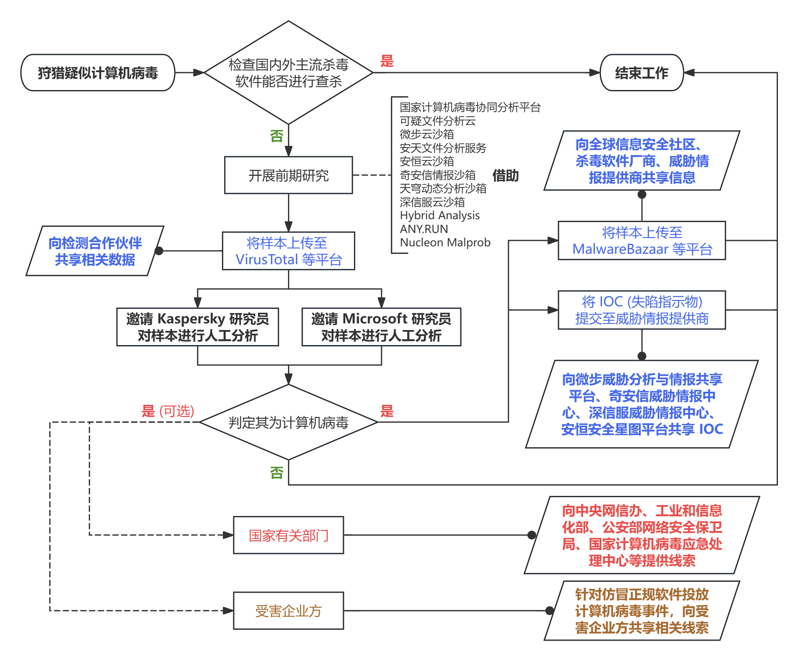
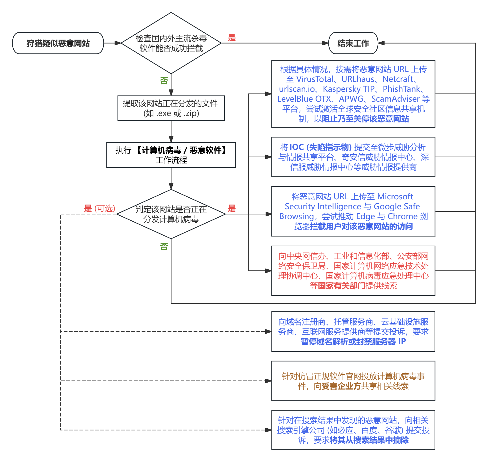

| &emsp;&emsp;&emsp;&emsp;&emsp;&emsp;&emsp;坚 持 筑 牢 国 家 网 络 安 全 屏 障&emsp;&emsp;&emsp;&emsp;&emsp;&emsp;&emsp; |
| :----------------------------------------------------------: |

| &emsp;&emsp;&emsp;&emsp;&emsp;&emsp;&emsp;没 有 网 络 安 全 就 没 有 国 家 安 全&emsp;&emsp;&emsp;&emsp;&emsp;&emsp;&emsp; |
| :----------------------------------------------------------: |

| &emsp;&emsp;&emsp;&emsp;&emsp;&emsp;&emsp;网 络 安 全 为 人 民&emsp;网 络 安 全 靠 人 民&emsp;&emsp;&emsp;&emsp;&emsp;&emsp;&emsp; |
| :----------------------------------------------------------: |

| &emsp;深 化 网 络 空 间 安 全 综 合 治 理&emsp;加 快 国 家 网 络 安 全 防 御 体 系 建 设&emsp; |
| :----------------------------------------------------------: |

<h1 align="center">灵糕中心 · 安全响应中心</h1>

<h3 align="center">Linggao Hub · Security Response Center (LGSRC)</h3>

[www.lgsrc.cn](https://www.lgsrc.cn) (门户) & [github.com/Lingggao/LGSRC](https://github.com/Lingggao/LGSRC) (GitHub)

&emsp;&emsp;**用于打击计算机病毒与恶意网站的 “[灵糕中心](https://github.com/Lingggao/LGHUB) · 安全响应中心”**。由独立网络安全研究员、中国计算机学会 (CCF) 会员兼计算机安全专业委员会委员 [**Ling Gao**](https://github.com/Lingggao/LGSRC/blob/main/Documents/Leadership.md) 领导。灵糕中心 · 安全响应中心创立于 2025 年 12 月 20 日。

> [!IMPORTANT]
>
> &emsp;灵糕中心为独立非营利组织，与其他企业不构成隶属、雇佣、代理等关系。

&emsp;&emsp;**宗旨**：独立管理、放眼全国、数据精确、打击迅速

## 工作流程

【**计算机病毒 / 恶意软件**】

---

【**恶意网站**】

---

**满足以下任一条件时，数据无需填入表格**

1. 多数杀毒软件可拦截该文件或网站，无需进行人工分析
2. 经前期分析，可 100% 确认为正常文件或网站
3. Microsoft 与 Kaspersky 安全研究员判定该文件或网站安全
4. 该文件或网站首次发现日期距今已超过 30 天
5. 由其他从业人员或志愿者发现、分析并上报，本中心全程未参与

## 数据

&emsp;&emsp;上次更新时间：2026 年 9 月 6 日 1:00 (GMT+8)

&emsp;&emsp;**截至 2026 年 9 月 6 日，本中心已打击计算机病毒 / 恶意软件 1,744 个、恶意网站 896 个，累计为潜在受害者规避经济损失约 7,412,000 元人民币**。[ $$E = \sum (W_i \times P_{\text{exec}} \times N_{\text{victim}} \times P_{\text{monetize}} \times V_{\text{loss}})$$ ] ([何意味？](https://github.com/Lingggao/LGSRC/blob/main/Documents/LossModel.md))

&emsp;&emsp;在对抗网络犯罪的崇高事业中，本中心仅承担了少量协调类工作。**恶意载荷从发现到清除，离不开国家有关部门、安全社区与研究员、杀毒软件厂商及威胁情报提供商的共同努力**。在此，谨向他们致以诚挚谢意。

&emsp;&emsp;**本中心每打击 1 个计算机病毒或恶意网站，将同步向[联合国儿童基金会](https://www.unicef.org/zh) “爱心为救灾” 计划捐赠 1 元人民币** (每月上限 230 元)。该计划旨在支持中国及其他国家实现可持续发展目标，尤其致力于为困境儿童提供援助。([捐款收据](https://github.com/Lingggao/LGSRC/blob/main/Images/%E6%8D%90%E6%AC%BE%E6%94%B6%E6%8D%AE.png))

&emsp;&emsp;2026 年 7 月 10 日，本中心通过广西慈善联合总会，向广西南宁贵港洪涝灾害受灾群众[捐赠](https://github.com/Lingggao/LGSRC/blob/main/Images/%E5%B9%BF%E8%A5%BF%E6%B4%AA%E6%B6%9D%E7%81%BE%E5%AE%B3.jpeg)人民币 2,026 元。

&emsp;&emsp;2026 年 8 月 28 日，本中心通过上海市红十字会，向西藏吉隆泥石流灾害抢险救援工作[捐赠](https://github.com/Lingggao/LGSRC/blob/main/Images/%E8%A5%BF%E8%97%8F%E6%B3%A5%E7%9F%B3%E6%B5%81%E7%81%BE%E5%AE%B3.jpg)人民币 1,500 元。

---

【**计算机病毒 / 恶意软件**】

> [!CAUTION]
>
> &emsp;为确保安全，本中心**不提供**计算机病毒 / 恶意软件样本下载服务。

|   日期   |         文件名         |          检测           |                            SHA256                            |             Internal ID              |                          VirusTotal                          |                        MalwareBazaar                         | 编号 |
| :------: | :--------------------: | :---------------------: | :----------------------------------------------------------: | :----------------------------------: | :----------------------------------------------------------: | :----------------------------------------------------------: | :--: |
| 2026/9/2 |       zTGy5v.exe       |  **银狐 (SilverFox)**   | 932642af5e7fc308e7a5f8d7d05697ec2fcbd161ff4cfbb34e2fa87cc759f812 | 6a75f65d-9886-435b-a2c7-d7c792e0bf5b | [VirusTotal](https://www.virustotal.com/gui/file/932642af5e7fc308e7a5f8d7d05697ec2fcbd161ff4cfbb34e2fa87cc759f812) (19) |                              无                              | 1725 |
| 2026/9/4 |  ···09.02人员名单.exe  | **银狐 (SilverFox.bg)** | bbba40d2bf3c25acd2449271c6b4e7ed2edeb2b022f2498480b6e25f2f443b14 | 9ddc0679-c6bc-49d9-b500-4e05aa491d3a | [VirusTotal](https://www.virustotal.com/gui/file/bbba40d2bf3c25acd2449271c6b4e7ed2edeb2b022f2498480b6e25f2f443b14) (6) | [MalwareBazaar Database](https://bazaar.abuse.ch/sample/bbba40d2bf3c25acd2449271c6b4e7ed2edeb2b022f2498480b6e25f2f443b14) | 1726 |
| 2026/9/4 |  ···9.03裁员名单.exe   | **银狐 (SilverFox.bg)** | 7b693ae6ed452fd1a584b321d236ce7305e3281b55497e5963060bd0d5db2ac4 | 6c71cac4-f5d6-4504-8c08-f88f96744e82 | [VirusTotal](https://www.virustotal.com/gui/file/7b693ae6ed452fd1a584b321d236ce7305e3281b55497e5963060bd0d5db2ac4) (7) | [MalwareBazaar Database](https://bazaar.abuse.ch/sample/7b693ae6ed452fd1a584b321d236ce7305e3281b55497e5963060bd0d5db2ac4) | 1727 |
| 2026/9/4 |   979298b278···.exe    | **银狐 (SilverFox.sd)** | 255cdacde3f3951fc41cad1d6a248f0bf27ae7aa4fa5b058848b3a1cb93533c4 | 808049d7-7acc-43b0-af3b-bdfc16f0dad1 | [VirusTotal](https://www.virustotal.com/gui/file/255cdacde3f3951fc41cad1d6a248f0bf27ae7aa4fa5b058848b3a1cb93533c4) (7) | [MalwareBazaar Database](https://bazaar.abuse.ch/sample/255cdacde3f3951fc41cad1d6a248f0bf27ae7aa4fa5b058848b3a1cb93533c4) | 1728 |
| 2026/9/4 |   aagregatorhast.exe   |  **银狐 (SilverFox)**   | bcec0dee5fd43ed238a5c3b781ad3bb3e2104b41904070e0823c9ddf79b08794 | 3df85f4a-dda1-4957-86bc-595091ad5a6c | [VirusTotal](https://www.virustotal.com/gui/file/bcec0dee5fd43ed238a5c3b781ad3bb3e2104b41904070e0823c9ddf79b08794) (12) | [MalwareBazaar Database](https://bazaar.abuse.ch/sample/bcec0dee5fd43ed238a5c3b781ad3bb3e2104b41904070e0823c9ddf79b08794) | 1729 |
| 2026/9/4 |   ec069fb673···.exe    |  **银狐 (SilverFox)**   | ee4feaed8563112f59a2cdc2519e84937de269725e4abb2789aa39652579f390 | 359a7204-2d12-4151-a764-5561e05759a0 | [VirusTotal](https://www.virustotal.com/gui/file/ee4feaed8563112f59a2cdc2519e84937de269725e4abb2789aa39652579f390) (23) | [MalwareBazaar Database](https://bazaar.abuse.ch/sample/ee4feaed8563112f59a2cdc2519e84937de269725e4abb2789aa39652579f390) | 1730 |
| 2026/9/4 |  install_q2.0.17.exe   |  **银狐 (SilverFox)**   | 3b8ded2f1ee256b99296ef86d74a270e735e4181425f04772701b3fcee16998d | 25155e3d-337b-472d-9971-484c682fe12a | [VirusTotal](https://www.virustotal.com/gui/file/3b8ded2f1ee256b99296ef86d74a270e735e4181425f04772701b3fcee16998d) (24) | [MalwareBazaar Database](https://bazaar.abuse.ch/sample/3b8ded2f1ee256b99296ef86d74a270e735e4181425f04772701b3fcee16998d) | 1731 |
| 2026/9/4 |     谷歌邮箱q.exe      |  **银狐 (SilverFox)**   | 06ab53bbaed63f89047c6f0ba9f8f75bebad421c783b15dfdaa8352a4fc01dc1 |                  无                  | [VirusTotal](https://www.virustotal.com/gui/file/06ab53bbaed63f89047c6f0ba9f8f75bebad421c783b15dfdaa8352a4fc01dc1) (11) |                              无                              | 1732 |
| 2026/9/4 |   9.02裁员···WPS.exe   | **银狐 (SilverFox.bg)** | e8bc6b3b66ab3f65df198b94200dee22fc62e750d21bf112443c8ad96b14fbba |                  无                  | [VirusTotal](https://www.virustotal.com/gui/file/e8bc6b3b66ab3f65df198b94200dee22fc62e750d21bf112443c8ad96b14fbba) (28) |                              无                              | 1733 |
| 2026/9/4 | @所有人···切勿外发.exe | **银狐 (SilverFox.bg)** | 1055656b4243a6f96db475f0fd2f8506a944f65eaea22789c409220b2b82040b | bdfefed2-6558-4902-8fc0-439055b6be37 | [VirusTotal](https://www.virustotal.com/gui/file/1055656b4243a6f96db475f0fd2f8506a944f65eaea22789c409220b2b82040b) (10) | [MalwareBazaar Database](https://bazaar.abuse.ch/sample/1055656b4243a6f96db475f0fd2f8506a944f65eaea22789c409220b2b82040b) | 1734 |
| 2026/9/4 |     9dfdd1eeed.exe     | **银狐 (SilverFox.bg)** | 50f8064aa9924f674b5b7d24d1562f35f11007cc8ef57a7a3ce07e0f713efba1 | af597741-b530-42c6-be11-e6bd521735f7 | [VirusTotal](https://www.virustotal.com/gui/file/50f8064aa9924f674b5b7d24d1562f35f11007cc8ef57a7a3ce07e0f713efba1) (14) | [MalwareBazaar Database](https://bazaar.abuse.ch/sample/50f8064aa9924f674b5b7d24d1562f35f11007cc8ef57a7a3ce07e0f713efba1) | 1735 |
| 2026/9/4 |       9月4 2.exe       |  **银狐 (SilverFox)**   | 13b5ce5838356cffbb328312b4509eef0662d2d3434b683f177bb0aaf8281b9c | 4390bc1a-453f-4993-9fb0-5787b594d559 | [VirusTotal](https://www.virustotal.com/gui/file/13b5ce5838356cffbb328312b4509eef0662d2d3434b683f177bb0aaf8281b9c) (10) | [MalwareBazaar Database](https://bazaar.abuse.ch/sample/13b5ce5838356cffbb328312b4509eef0662d2d3434b683f177bb0aaf8281b9c) | 1736 |
| 2026/9/4 |  ···9.03裁员名单.exe   | **银狐 (SilverFox.bg)** | f650d42dc1d33f8e776b9eadbc7f8789868b20d97b48d1d2338532ba81d36337 | d59a4b20-9496-4a72-a1eb-5a61163035a3 | [VirusTotal](https://www.virustotal.com/gui/file/f650d42dc1d33f8e776b9eadbc7f8789868b20d97b48d1d2338532ba81d36337) (7) | [MalwareBazaar Database](https://bazaar.abuse.ch/sample/f650d42dc1d33f8e776b9eadbc7f8789868b20d97b48d1d2338532ba81d36337) | 1737 |
| 2026/9/4 | sssjhvycytjnjoo···.exe | **银狐 (SilverFox.bg)** | 966b1fea9cdc54843a728b1a870bfb7d2f8109085b6114455d6e2635ab1ad40f | ef9f8d94-7576-4194-af09-1f81636c33a7 | [VirusTotal](https://www.virustotal.com/gui/file/966b1fea9cdc54843a728b1a870bfb7d2f8109085b6114455d6e2635ab1ad40f) (10) | [MalwareBazaar Database](https://bazaar.abuse.ch/sample/966b1fea9cdc54843a728b1a870bfb7d2f8109085b6114455d6e2635ab1ad40f) | 1738 |
| 2026/9/5 |  install_q2.0.02.exe   |  **银狐 (SilverFox)**   | f08a43f566e84eb22984fbc81d2ef8ca94d732362ca6b2324edf9a95ea7e7f58 | 7cc3a74e-b31b-42e0-9a96-d82a8b952844 | [VirusTotal](https://www.virustotal.com/gui/file/f08a43f566e84eb22984fbc81d2ef8ca94d732362ca6b2324edf9a95ea7e7f58) (28) | [MalwareBazaar Database](https://bazaar.abuse.ch/sample/f08a43f566e84eb22984fbc81d2ef8ca94d732362ca6b2324edf9a95ea7e7f58) | 1739 |
| 2026/9/5 |      ths_win.exe       |  **银狐 (SilverFox)**   | 1e2691c472537c5fe8210c1aade9ad8d912de3dc765a5841631177f36b7437a3 | f6aa640d-f146-4a88-b6e6-ccd21d52eede | [VirusTotal](https://www.virustotal.com/gui/file/1e2691c472537c5fe8210c1aade9ad8d912de3dc765a5841631177f36b7437a3) (4) |                              无                              | 1740 |
| 2026/9/6 | QISHUIl···6436339.exe  |  **银狐 (SilverFox)**   | a3ccae19568ea4cb16f069a8d544eed755ccc4e714b9368ec7538021acf4f2dd | 8eb1743e-fbe4-4264-bac6-ebe78f8a84a6 | [VirusTotal](https://www.virustotal.com/gui/file/a3ccae19568ea4cb16f069a8d544eed755ccc4e714b9368ec7538021acf4f2dd) (34) |                              无                              | 1741 |
| 2026/9/6 |  QQ电脑版···zy6zd.exe  |  **银狐 (SilverFox)**   | f535cdbb32dd25fa7dfbcdbae96eafbd5740882e46355c78c895224de6f22e4e | c5b1472e-6870-46c2-b986-c512d0d60a84 | [VirusTotal](https://www.virustotal.com/gui/file/f535cdbb32dd25fa7dfbcdbae96eafbd5740882e46355c78c895224de6f22e4e) (53) | [MalwareBazaar Database](https://bazaar.abuse.ch/sample/f535cdbb32dd25fa7dfbcdbae96eafbd5740882e46355c78c895224de6f22e4e) | 1742 |
| 2026/9/6 |       TT语音.exe       |  **银狐 (SilverFox)**   | dd8ab9fa7766159292c8f84d310afdf0af33fa318e94cac99dc478e851cb32e4 | 6fe28ad0-786c-49e2-91f6-e959813a0614 | [VirusTotal](https://www.virustotal.com/gui/file/dd8ab9fa7766159292c8f84d310afdf0af33fa318e94cac99dc478e851cb32e4) (46) |                              无                              | 1743 |
| 2026/9/6 |      wcxxrphz.exe      |  **银狐 (SilverFox)**   | e34b5226de85b9bc11b6beff659b1c8ad0799a44a04184735c9dd8f380b8f05f | 7049a531-b50e-41da-881c-cf756464055c | [VirusTotal](https://www.virustotal.com/gui/file/e34b5226de85b9bc11b6beff659b1c8ad0799a44a04184735c9dd8f380b8f05f) (4) | [MalwareBazaar Database](https://bazaar.abuse.ch/sample/e34b5226de85b9bc11b6beff659b1c8ad0799a44a04184735c9dd8f380b8f05f) | 1744 |
|  ——————  |      ————————————      |      ————————————       |             ———————————————————————————————————              |         ————————————————————         |                           ————————                           |                         ————————————                         | ———  |

> [!NOTE]
>
> &emsp;只显示最近 20 条数据，更早数据详见 LGSRC/[Archive_1.md](https://github.com/Lingggao/LGSRC/blob/main/Archive_1.md) (计算机病毒 / 恶意软件归档)。

---

【**恶意网站**】

> [!CAUTION]
>
> &emsp;为确保安全，网站地址将用 “hxxps://” 与 “[.]” 进行替换。**切勿尝试访问表格中列出的任何网址**。

|   日期    |                     URL                     |              类别              |                           有效载荷                           |                         URLhaus                          | 编号 |
| :-------: | :-----------------------------------------: | :----------------------------: | :----------------------------------------------------------: | :------------------------------------------------------: | :--: |
| 2026/8/31 |    hxxps://www[.]tx-guanjian[.]com[.]cn     | **仿冒腾讯电脑管家、传播病毒** |              hxxps://www[.]dvl51m[.]com/insdw62              |                            无                            | 877  |
| 2026/8/31 |      hxxps://www[.]ryzhe[.]com/down88       |        **传播银狐病毒**        |                       有，载荷提取失败                       | [URLhaus Database](https://urlhaus.abuse.ch/url/3910252) | 878  |
| 2026/8/31 |       hxxps://sogobrowser[.]com[.]cn        |  **仿冒搜狗浏览器、传播病毒**  |                            同 878                            |                            无                            | 879  |
| 2026/8/31 |        hxxps://sgbrowser[.]com[.]cn         |  **仿冒搜狗浏览器、传播病毒**  |                            同 878                            |                            无                            | 880  |
| 2026/8/31 |         hxxps://sou-gou[.]com[.]cn          |  **仿冒搜狗浏览器、传播病毒**  | hxxps://download-sougou[.]com[.]cn/donwnload/sougouExpiorerr_Setup_x64_25537[.]zip | [URLhaus Database](https://urlhaus.abuse.ch/url/3910253) | 881  |
| 2026/8/31 |      hxxps://browser-sogou[.]com[.]cn       |  **仿冒搜狗浏览器、传播病毒**  |                            同 881                            |                            无                            | 882  |
| 2026/8/31 |      hxxps://sogoubrowsers[.]com[.]cn       |  **仿冒搜狗浏览器、传播病毒**  |                            同 881                            |                            无                            | 883  |
| 2026/8/31 |     hxxps://web-sogoubrowser[.]com[.]cn     |  **仿冒搜狗浏览器、传播病毒**  |                            同 881                            |                            无                            | 884  |
| 2026/8/31 |      hxxps://browser-sogouq[.]com[.]cn      |  **仿冒搜狗浏览器、传播病毒**  |                            同 881                            |                            无                            | 885  |
| 2026/8/31 | hxxps://www[.]browser-sogou-apps[.]com[.]cn |  **仿冒搜狗浏览器、传播病毒**  |                            同 881                            |                            无                            | 886  |
| 2026/8/31 |    hxxps://browser-sougou-zh[.]com[.]cn     |  **仿冒搜狗浏览器、传播病毒**  |                            同 881                            |                            无                            | 887  |
| 2026/9/3  |         hxxps://net-bcut[.]com[.]cn         |     **仿冒必剪、传播病毒**     |               hxxps://www[.]ryzhe[.]com/down88               |                            无                            | 888  |
| 2026/9/3  |         hxxps://org-bcut[.]com[.]cn         |     **仿冒必剪、传播病毒**     |                            同 888                            |                            无                            | 889  |
| 2026/9/3  |         hxxps://app-bcut[.]com[.]cn         |     **仿冒必剪、传播病毒**     |                            同 888                            |                            无                            | 890  |
| 2026/9/5  |        hxxps://qianwen-ch[.]com[.]cn        |    **仿冒同花顺、传播病毒**    |                            同 888                            |                            无                            | 891  |
| 2026/9/5  |     hxxps://www[.]10jqka-ka[.]com[.]cn      |    **仿冒同花顺、传播病毒**    |    注：仅在必应搜索结果中点击该链接时，才会跳转至恶意网站    |                            无                            | 892  |
| 2026/9/5  |        hxxps://10jqka-gh[.]com[.]cn         |    **仿冒同花顺、传播病毒**    |    注：仅在必应搜索结果中点击该链接时，才会跳转至恶意网站    |                            无                            | 893  |
| 2026/9/5  |    hxxps://www[.]10jqka-world[.]com[.]cn    |    **仿冒同花顺、传播病毒**    |    注：仅在必应搜索结果中点击该链接时，才会跳转至恶意网站    |                            无                            | 894  |
| 2026/9/5  |       hxxps://10jqka-work[.]com[.]cn        |    **仿冒同花顺、传播病毒**    |    注：仅在必应搜索结果中点击该链接时，才会跳转至恶意网站    |                            无                            | 895  |
| 2026/9/5  |      hxxps://zh[.]10jqka-qz[.]com[.]cn      |    **仿冒同花顺、传播病毒**    |    注：仅在必应搜索结果中点击该链接时，才会跳转至恶意网站    |                            无                            | 896  |
|  ——————   |            ————————————————————             |        ———————————————         |                ——————————————————————————————                |                        ——————————                        | ———  |

> [!NOTE]
>
> &emsp;只显示最近 20 条数据，更早数据详见 LGSRC/[Archive_2.md](https://github.com/Lingggao/LGSRC/blob/main/Archive_2.md) (恶意网站归档)。
>
> &emsp;暂时无暇核实与处理的疑似恶意网站详见 LGSRC/[Archive_3.md](https://github.com/Lingggao/LGSRC/blob/main/Archive_3.md) (仅记录，未核实且未打击)。

## 交流与合作

&emsp;&emsp;[安全响应中心 管理委员会](https://github.com/Lingggao/LGSRC/blob/main/Documents/Leadership.md)

&emsp;&emsp;如需联系 Ling Gao，请发送电子邮件至 **ling@lghub.org** 或 **ling_gao@acm.org**。谢谢！🥰

&emsp;&emsp;如需协助检测文件样本是否具有恶意行为，请将其上传至[微步云沙箱](https://s.threatbook.com)和 [VirusTotal](https://www.virustotal.com)，并将 **SHA256** 填写至[此表单](https://forms.cloud.microsoft/Pages/ResponsePage.aspx?id=39DabECOEk2JZekK_Z5UjJJAHDqug_FNgSvl5TTF-MJUM1pISDk0VTFLNjhHVVpJQ0FHVDlLMjcwMi4u) **(请勿直接发送文件本体)**。本中心将独立开展研究，并在 2 个工作日内回复您的邮件。在第三方平台上传样本前，请认真阅读服务条款与隐私政策，文件中请勿包含个人信息。

&emsp;&emsp;欢迎体验我们编写的 **OpenClaw** (龙虾 AI Agent) 技能 [**vt-insight**](https://github.com/Lingggao/LGSRC/blob/main/vt-insight/SKILL.md)！该技能可用于在 VirusTotal 网站查询样本信息，自动整理并格式化输出查询报告。([效果图 ①](https://github.com/Lingggao/LGSRC/blob/main/Images/Rendering%201.png)) ([效果图 ②](https://github.com/Lingggao/LGSRC/blob/main/Images/Rendering%202.png)) 向 AI 大模型发送指令 `“将此 .md 文档作为 OpenClaw 技能安装：https://github.com/Lingggao/LGSRC/blob/main/vt-insight/SKILL.md，安装成功后进行简要介绍。”` 即可安装此技能，前往[**微步 Skill 广场**](https://x.threatbook.com/v5/skill/58eeb86ccd5fc240e8e04a24520e6158)或 [ClawHub](https://clawhub.ai/lingggao/vt-insight) 安装亦可。([vt-insight 技能安全审计报告](https://github.com/Lingggao/LGSRC/blob/main/Documents/vt-insight-security-audit-report%20(%E8%85%BE%E8%AE%AF%E5%AE%89%E5%85%A8%E4%BA%91%E9%BC%8E%E5%AE%9E%E9%AA%8C%E5%AE%A4).md)) ([微步 SafeSkill 检测报告](https://safeskill.cn/report/3bd851387126652d775c0a5e42fa60051b1ca16e6cad7c9b3088e89b09105a2b))

&emsp;&emsp;[**恶意软件研究工具集**](https://github.com/Lingggao/LGSRC/blob/main/Documents/Toolkit.md)

&emsp;&emsp;[《**常被 “银狐” 犯罪团伙仿冒的软件列表及注意事项**》](https://github.com/Lingggao/LGSRC/blob/main/Documents/List.md)

&emsp;&emsp;[《**“银狐” 威胁动态：官方及网络安全企业文章汇编**》](https://github.com/Lingggao/LGSRC/blob/main/Documents/SilverFox_Articles.md)

&emsp;&emsp;**银狐 IOC 情报合集**：[**VirusTotal**](https://www.virustotal.com/gui/collection/c4dd0a03e18770678ba094169aa006095d3a0cbda29587567507f8d956db38e1) + [**LevelBlue OTX**](https://otx.alienvault.com/pulse/6a36fe5a3c1568785b59c4d7)&emsp;实时更新，已收录 1,600 项情报 (文件、URL、域名、IP)

---

[回到顶部](#HEAD)

  

在 “[署名 - 相同方式共享 4.0](https://creativecommons.org/licenses/by-sa/4.0/legalcode.zh-Hans)” (CC BY-SA 4.0) 协议之条款下提供。

2025 - 2026, [Ling Gao](https://github.com/Lingggao/LGSRC/blob/main/Documents/Leadership.md), 灵糕中心 · 安全响应中心, [github.com/Lingggao/LGSRC](https://github.com/Lingggao/LGSRC)