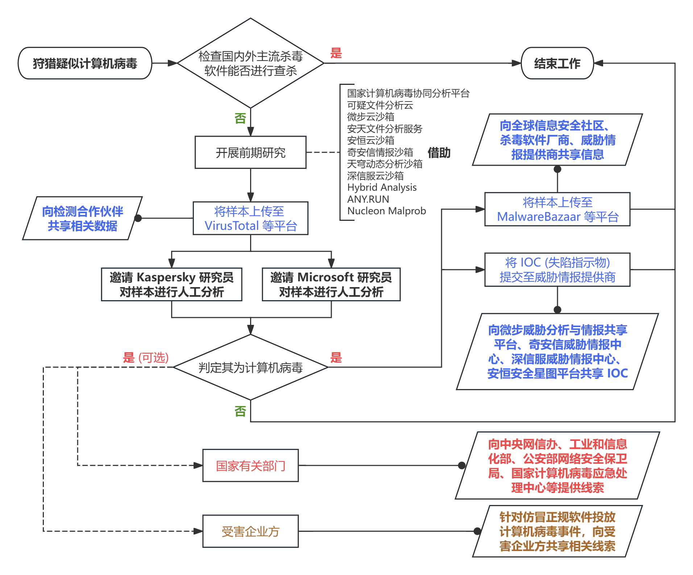
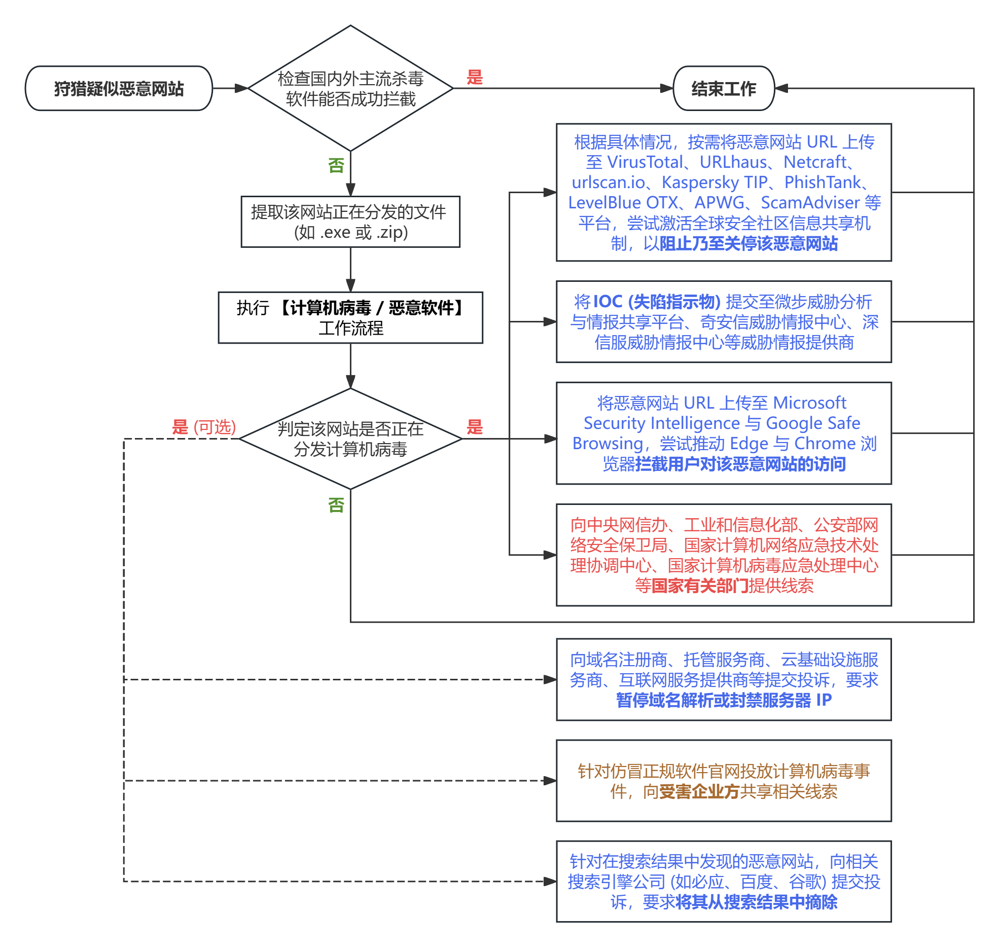

| &emsp;&emsp;&emsp;&emsp;&emsp;&emsp;&emsp;坚 持 筑 牢 国 家 网 络 安 全 屏 障&emsp;&emsp;&emsp;&emsp;&emsp;&emsp;&emsp; |
| :----------------------------------------------------------: |

| &emsp;&emsp;&emsp;&emsp;&emsp;&emsp;&emsp;没 有 网 络 安 全 就 没 有 国 家 安 全&emsp;&emsp;&emsp;&emsp;&emsp;&emsp;&emsp; |
| :----------------------------------------------------------: |

| &emsp;&emsp;&emsp;&emsp;&emsp;&emsp;&emsp;网 络 安 全 为 人 民&emsp;网 络 安 全 靠 人 民&emsp;&emsp;&emsp;&emsp;&emsp;&emsp;&emsp; |
| :----------------------------------------------------------: |

| &emsp;深 化 网 络 空 间 安 全 综 合 治 理&emsp;加 快 国 家 网 络 安 全 防 御 体 系 建 设&emsp; |
| :----------------------------------------------------------: |

<h1 align="center">灵糕中心 · 安全响应中心</h1>

<h3 align="center">Linggao Hub · Security Response Center (LGSRC)</h3>

[www.lgsrc.cn](https://www.lgsrc.cn) (门户) & [github.com/Lingggao/LGSRC](https://github.com/Lingggao/LGSRC) (GitHub)

&emsp;&emsp;**用于打击计算机病毒与恶意网站的 “[灵糕中心](https://github.com/Lingggao/LGHUB) · 安全响应中心”**。由独立网络安全研究员、中国计算机学会 (CCF) 会员兼计算机安全专业委员会委员 [**Ling Gao**](https://github.com/Lingggao/LGSRC/blob/main/Documents/Leadership.md) 领导。灵糕中心 · 安全响应中心创立于 2025 年 12 月 20 日。

> [!IMPORTANT]
>
> &emsp;灵糕中心为独立非营利组织，与其他企业不构成隶属、雇佣、代理等关系。

&emsp;&emsp;**宗旨**：独立管理、放眼全国、数据精确、打击迅速

## 工作流程

【**计算机病毒 / 恶意软件**】

---

【**恶意网站**】

---

**满足以下任一条件时，数据无需填入表格**

1. 多数杀毒软件可拦截该文件或网站，无需进行人工分析
2. 经前期分析，可 100% 确认为正常文件或网站
3. Microsoft 与 Kaspersky 安全研究员判定该文件或网站安全
4. 该文件或网站首次发现日期距今已超过 30 天
5. 由其他从业人员或志愿者发现、分析并上报，本中心全程未参与

## 数据

&emsp;&emsp;上次更新时间：2026 年 10 月 8 日 17:00 (GMT+8)

&emsp;&emsp;**截至 2026 年 10 月 8 日，本中心已打击计算机病毒 / 恶意软件 1,886 个、恶意网站 955 个，累计为潜在受害者规避经济损失约 8,015,500 元人民币**。[ $$E = \sum (W_i \times P_{\text{exec}} \times N_{\text{victim}} \times P_{\text{monetize}} \times V_{\text{loss}})$$ ] ([何意味？](https://github.com/Lingggao/LGSRC/blob/main/Documents/LossModel.md))

&emsp;&emsp;在对抗网络犯罪的崇高事业中，本中心仅承担了少量协调类工作。**恶意载荷从发现到清除，离不开国家有关部门、安全社区与研究员、杀毒软件厂商及威胁情报提供商的共同努力**。在此，谨向他们致以诚挚谢意。

---

&emsp;&emsp;**本中心每打击 1 个计算机病毒或恶意网站，将同步向[联合国儿童基金会](https://www.unicef.org/zh) “爱心为救灾” 计划捐赠 1 元人民币** (每月上限 230 元)。该计划旨在支持中国及其他国家实现可持续发展目标，尤其致力于为困境儿童提供援助。([捐款收据](https://github.com/Lingggao/LGSRC/blob/main/Images/%E6%8D%90%E6%AC%BE%E6%94%B6%E6%8D%AE.png))

&emsp;&emsp;2026 年 7 月 10 日，本中心通过广西慈善联合总会，向广西南宁贵港洪涝灾害受灾群众[捐赠](https://github.com/Lingggao/LGSRC/blob/main/Images/%E5%B9%BF%E8%A5%BF%E6%B4%AA%E6%B6%9D%E7%81%BE%E5%AE%B3.jpeg)人民币 2,026 元；2026 年 8 月 28 日，本中心通过上海市红十字会，向西藏吉隆泥石流灾害抢险救援工作[捐赠](https://github.com/Lingggao/LGSRC/blob/main/Images/%E8%A5%BF%E8%97%8F%E6%B3%A5%E7%9F%B3%E6%B5%81%E7%81%BE%E5%AE%B3.jpg)人民币 1,500 元。

---

【**计算机病毒 / 恶意软件**】

> [!CAUTION]
>
> &emsp;为确保安全，本中心**不提供**计算机病毒 / 恶意软件样本下载服务。

|   日期    |          文件名          |          检测           |                            SHA256                            |             Internal ID              |                          VirusTotal                          |                        MalwareBazaar                         | 编号 |
| :-------: | :----------------------: | :---------------------: | :----------------------------------------------------------: | :----------------------------------: | :----------------------------------------------------------: | :----------------------------------------------------------: | :--: |
| 2026/10/4 |  instdoload.1.3.14.exe   | **银狐 (SilverFox.bm)** | 26bd0c60678368a658f2ce253c5280158bde8683cb20b3cadee9cfd2ab93fae7 | f10320f4-83fa-4ebd-88c6-ce6dc2fb06f6 | [VirusTotal](https://www.virustotal.com/gui/file/26bd0c60678368a658f2ce253c5280158bde8683cb20b3cadee9cfd2ab93fae7) (30) | [MalwareBazaar Database](https://bazaar.abuse.ch/sample/26bd0c60678368a658f2ce253c5280158bde8683cb20b3cadee9cfd2ab93fae7) | 1867 |
| 2026/10/4 |  instdoload.1.3.15.exe   | **银狐 (SilverFox.bm)** | 218e743d49c1060a7d9e1d250ed4fb4372aefc2a0892fadd70f09c4f68a25d16 | 4936d485-887e-4413-a292-4e2fe3b11b7f | [VirusTotal](https://www.virustotal.com/gui/file/218e743d49c1060a7d9e1d250ed4fb4372aefc2a0892fadd70f09c4f68a25d16) (30) | [MalwareBazaar Database](https://bazaar.abuse.ch/sample/218e743d49c1060a7d9e1d250ed4fb4372aefc2a0892fadd70f09c4f68a25d16) | 1868 |
| 2026/10/4 |      UU_aNCcWz7.exe      |  **银狐 (SilverFox)**   | dc845c8a2cab50e854d194478ffe1c1f6cf622fa5c4bac61e416d82f6145ae3f | 9eb847fc-ed9e-4106-b294-3eb853cc6603 | [VirusTotal](https://www.virustotal.com/gui/file/dc845c8a2cab50e854d194478ffe1c1f6cf622fa5c4bac61e416d82f6145ae3f) (11) |                              无                              | 1869 |
| 2026/10/4 |     uuyc_4.34.0.exe      |  **银狐 (SilverFox)**   | 1bbbd8b231f7d8f8dca7dfded5cd7908427f68db49edad24ec5fa21c9cbab0f7 | 6a6e7c92-6781-4616-a8ac-21069b6a2db7 | [VirusTotal](https://www.virustotal.com/gui/file/1bbbd8b231f7d8f8dca7dfded5cd7908427f68db49edad24ec5fa21c9cbab0f7) (5) |                              无                              | 1870 |
| 2026/10/4 |     WinNetUplock.exe     |  **银狐 (SilverFox)**   | ec1af4dfc37ad1507e33541298690043813cadba90f2cc0bd771d2871e5bfc72 | c08f0596-05b7-44cc-bb62-3d8c033f4fb9 | [VirusTotal](https://www.virustotal.com/gui/file/ec1af4dfc37ad1507e33541298690043813cadba90f2cc0bd771d2871e5bfc72) (10) | [MalwareBazaar Database](https://bazaar.abuse.ch/sample/ec1af4dfc37ad1507e33541298690043813cadba90f2cc0bd771d2871e5bfc72) | 1871 |
| 2026/10/4 |  sogou_shurufa_x64.exe   |  **银狐 (SilverFox)**   | e0d1269cc2f66712bc751aab27555015f140e7c60316f367808e4ecc77264cfd | 02cb34fc-8948-459c-bafa-22338d220c6d | [VirusTotal](https://www.virustotal.com/gui/file/e0d1269cc2f66712bc751aab27555015f140e7c60316f367808e4ecc77264cfd) (6) |                              无                              | 1872 |
| 2026/10/4 | SogouExplorer···210.exe  |  **银狐 (SilverFox)**   | c69db52bf3498ec52a1982671ceb5a5c93cc95e09d12676127e17691e8bbe5f8 | c1a1e7a4-4e93-4005-ab2a-c5574be06ca1 | [VirusTotal](https://www.virustotal.com/gui/file/c69db52bf3498ec52a1982671ceb5a5c93cc95e09d12676127e17691e8bbe5f8) (10) |                              无                              | 1873 |
| 2026/10/4 |  SogouExplorer21···.exe  |  **银狐 (SilverFox)**   | 29bbe7f9bc61247931c5be15bba6da9d733baa42ff57d565080779ca5919bc49 | 00907652-bded-4789-b3dd-bac988107bf9 | [VirusTotal](https://www.virustotal.com/gui/file/29bbe7f9bc61247931c5be15bba6da9d733baa42ff57d565080779ca5919bc49) (8) |                              无                              | 1874 |
| 2026/10/5 |   AntMessenger···.exe    |  **银狐 (SilverFox)**   | 1627a517ff01361167ea3eabd6d4bfeebfc32d0755eb8245373b9d96e9553dc4 | 71ff1fb5-b629-44c5-87ce-eb0dbb2e952c | [VirusTotal](https://www.virustotal.com/gui/file/1627a517ff01361167ea3eabd6d4bfeebfc32d0755eb8245373b9d96e9553dc4) (8) |                              无                              | 1875 |
| 2026/10/5 |       flclash.exe        |  **银狐 (SilverFox)**   | 01dec44e70c5c84d2e790a3f2bd4e8613ba82ebd1d13bfb9e4df20ea476ca559 | 7b9e7b31-d7ca-40d9-be5c-47b83e20d064 | [VirusTotal](https://www.virustotal.com/gui/file/01dec44e70c5c84d2e790a3f2bd4e8613ba82ebd1d13bfb9e4df20ea476ca559) (11) | [MalwareBazaar Database](https://bazaar.abuse.ch/sample/01dec44e70c5c84d2e790a3f2bd4e8613ba82ebd1d13bfb9e4df20ea476ca559) | 1876 |
| 2026/10/5 |     goujijiasuqi.exe     |  **银狐 (SilverFox)**   | ba5088e6fff5b63a2316fc273029bb651436be91618ba53425e24e23c798ab2a | 28a500a7-53f5-464e-96bb-1719c3d1d3fc | [VirusTotal](https://www.virustotal.com/gui/file/ba5088e6fff5b63a2316fc273029bb651436be91618ba53425e24e23c798ab2a) (10) | [MalwareBazaar Database](https://bazaar.abuse.ch/sample/ba5088e6fff5b63a2316fc273029bb651436be91618ba53425e24e23c798ab2a) | 1877 |
| 2026/10/5 |     lightxtreme.exe      |  **银狐 (SilverFox)**   | f31ece43389d70c6351fa607e08e31a1e11f5d9d77968f4b515c833a1628973a | e626b58e-02e5-470a-b709-43bf735c0afe | [VirusTotal](https://www.virustotal.com/gui/file/f31ece43389d70c6351fa607e08e31a1e11f5d9d77968f4b515c833a1628973a) (11) | [MalwareBazaar Database](https://bazaar.abuse.ch/sample/f31ece43389d70c6351fa607e08e31a1e11f5d9d77968f4b515c833a1628973a) | 1878 |
| 2026/10/5 |        quickq.exe        |  **银狐 (SilverFox)**   | 25a546a305fbfe3b05f90139fe3f007818e5668192c6b74a9ea861b496de6566 | 5fd0e4ef-8ae6-4629-b312-840488426b40 | [VirusTotal](https://www.virustotal.com/gui/file/25a546a305fbfe3b05f90139fe3f007818e5668192c6b74a9ea861b496de6566) (11) | [MalwareBazaar Database](https://bazaar.abuse.ch/sample/25a546a305fbfe3b05f90139fe3f007818e5668192c6b74a9ea861b496de6566) | 1879 |
| 2026/10/5 | Setup_winletlatst···.exe |  **银狐 (SilverFox)**   | 8b1b1714d9544d86284accdd3240df5ef641cf5504f4c8baebec5387e966524f | ccabedb0-da4d-4191-94e5-77f8fe32a089 | [VirusTotal](https://www.virustotal.com/gui/file/8b1b1714d9544d86284accdd3240df5ef641cf5504f4c8baebec5387e966524f) (21) | [MalwareBazaar Database](https://bazaar.abuse.ch/sample/8b1b1714d9544d86284accdd3240df5ef641cf5504f4c8baebec5387e966524f) | 1880 |
| 2026/10/5 |        7.0_64.exe        |  **银狐 (SilverFox)**   | aedb264e412ea574ad4ef2bdf5d857397b0fdfc429cfbce47a35d280b15ca503 | 8d77ae1d-33e6-47c3-af74-4899cc54a408 | [VirusTotal](https://www.virustotal.com/gui/file/aedb264e412ea574ad4ef2bdf5d857397b0fdfc429cfbce47a35d280b15ca503) (27) | [MalwareBazaar Database](https://bazaar.abuse.ch/sample/aedb264e412ea574ad4ef2bdf5d857397b0fdfc429cfbce47a35d280b15ca503) | 1881 |
| 2026/10/5 |      Silverfox.exe       |  **银狐 (SilverFox)**   | 6bde7ba7c5c9b5f000c2255dd3f87340a96ca9fbdf2b2d4688251c9adb4b88a2 | 7286f79a-2c1a-4490-8e11-96d0b1c6fde5 | [VirusTotal](https://www.virustotal.com/gui/file/6bde7ba7c5c9b5f000c2255dd3f87340a96ca9fbdf2b2d4688251c9adb4b88a2) (40) | [MalwareBazaar Database](https://bazaar.abuse.ch/sample/6bde7ba7c5c9b5f000c2255dd3f87340a96ca9fbdf2b2d4688251c9adb4b88a2) | 1882 |
| 2026/10/6 |  instdoload.1.3.02.exe   | **银狐 (SilverFox.bm)** | a0cede6f584d24707449eb5fd9a35ea0d380e9bcaa6c37c99a65bc90a3dbb9ac | f191151c-681b-4118-9011-4add9d46f044 | [VirusTotal](https://www.virustotal.com/gui/file/a0cede6f584d24707449eb5fd9a35ea0d380e9bcaa6c37c99a65bc90a3dbb9ac) (32) | [MalwareBazaar Database](https://bazaar.abuse.ch/sample/a0cede6f584d24707449eb5fd9a35ea0d380e9bcaa6c37c99a65bc90a3dbb9ac) | 1883 |
| 2026/10/6 |  instdoload.1.3.09.exe   | **银狐 (SilverFox.bm)** | d519f610b614473e4440c2a5480c62cdf7273c16e907dc3a3779bdbbeffdd931 | 1532d79c-dc23-4bef-8a56-8acf66afb431 | [VirusTotal](https://www.virustotal.com/gui/file/d519f610b614473e4440c2a5480c62cdf7273c16e907dc3a3779bdbbeffdd931) (32) | [MalwareBazaar Database](https://bazaar.abuse.ch/sample/d519f610b614473e4440c2a5480c62cdf7273c16e907dc3a3779bdbbeffdd931) | 1884 |
| 2026/10/7 |    WPS_Office_x64.exe    |  **银狐 (SilverFox)**   | 14daf4e07c92a2e4a83e658a76a54ed907c7f3885de63149b64dc3168e55702f | ac3eae40-c124-4392-bb82-80d30573ec0d | [VirusTotal](https://www.virustotal.com/gui/file/14daf4e07c92a2e4a83e658a76a54ed907c7f3885de63149b64dc3168e55702f) (8) |                              无                              | 1885 |
| 2026/10/7 |    WPS_Setup_X64.exe     |  **银狐 (SilverFox)**   | 88b58b1afc28edc39f88e70db7a35c641f922add817e429ca5d7462e9207e6d0 | 9dbf6c5d-1022-49f0-9496-0b656f1e3212 | [VirusTotal](https://www.virustotal.com/gui/file/88b58b1afc28edc39f88e70db7a35c641f922add817e429ca5d7462e9207e6d0) (12) |                              无                              | 1886 |
|  ——————   |       ————————————       |      ————————————       |             ———————————————————————————————————              |         ————————————————————         |                           ————————                           |                         ————————————                         | ———  |

> [!NOTE]
>
> &emsp;只显示最近 20 条数据，更早数据详见 LGSRC/[Archive_1.md](https://github.com/Lingggao/LGSRC/blob/main/Archive_1.md) (计算机病毒 / 恶意软件归档)。

---

【**恶意网站**】

> [!CAUTION]
>
> &emsp;为确保安全，网站地址将用 “hxxps://” 与 “[.]” 进行替换。**切勿尝试访问表格中列出的任何网址**。

|   日期    |                  URL                  |              类别              |                           有效载荷                           |                         URLhaus                          | 编号 |
| :-------: | :-----------------------------------: | :----------------------------: | :----------------------------------------------------------: | :------------------------------------------------------: | :--: |
| 2026/10/4 |   hxxps://soogoubrowser[.]com[.]cn    |  **仿冒搜狗浏览器、传播病毒**  | hxxps://wwwiiisss[.]oss-ap-northeast-1[.]aliyuncs[.]com/SogouExplorer21_windows[.]zip |                            无                            | 936  |
| 2026/10/4 |    hxxps://sogoubrowser[.]com[.]cn    |  **仿冒搜狗浏览器、传播病毒**  | hxxps://sogo-download[.]oss-cn-hongkong[.]aliyuncs[.]com/sougouExpiorerr_Setup_x64[.]zip | [URLhaus Database](https://urlhaus.abuse.ch/url/3928286) | 937  |
| 2026/10/4 |   hxxps://soogou-browser[.]com[.]cn   |  **仿冒搜狗浏览器、传播病毒**  |                            同 936                            |                            无                            | 938  |
| 2026/10/4 | hxxps://apps-sogoubrowser[.]com[.]cn  |  **仿冒搜狗浏览器、传播病毒**  |                            同 936                            |                            无                            | 939  |
| 2026/10/4 |  hxxps://app-sogoubrowser[.]com[.]cn  |  **仿冒搜狗浏览器、传播病毒**  |                            同 937                            |                            无                            | 940  |
| 2026/10/4 |  hxxps://of-sogoubrowser[.]com[.]cn   |  **仿冒搜狗浏览器、传播病毒**  |                            同 936                            |                            无                            | 941  |
| 2026/10/5 |       hxxps://uupro[.]com[.]cn        | **仿冒网易 UU 远程、传播病毒** | hxxps://2026uuyuancheng[.]oss-cn-hongkong[.]aliyuncs[.]com/UUycSetup[.]7[.]13[.]zip |                            无                            | 942  |
| 2026/10/5 |   hxxps://uuyuanchengzh[.]com[.]cn    | **仿冒网易 UU 远程、传播病毒** |     hxxps://uu[.]v2raynapps[.]com[.]cn/UU_aNCcWz7[.]zip      | [URLhaus Database](https://urlhaus.abuse.ch/url/3929202) | 943  |
| 2026/10/7 |      hxxps://wpssite[.]com[.]cn       |     **仿冒 WPS、传播病毒**     |    注：仅在必应搜索结果中点击该链接时，才会跳转至恶意网站    |                            无                            | 944  |
| 2026/10/7 |       hxxps://wps-ty[.]com[.]cn       |     **仿冒 WPS、传播病毒**     |    注：仅在必应搜索结果中点击该链接时，才会跳转至恶意网站    |                            无                            | 945  |
| 2026/10/7 |    hxxps://www[.]wps-ad[.]com[.]cn    |     **仿冒 WPS、传播病毒**     |    注：仅在必应搜索结果中点击该链接时，才会跳转至恶意网站    |                            无                            | 946  |
| 2026/10/7 |  hxxps://wps-office-bing[.]com[.]cn   |     **仿冒 WPS、传播病毒**     |    注：仅在必应搜索结果中点击该链接时，才会跳转至恶意网站    |                            无                            | 947  |
| 2026/10/7 |  hxxps://www[.]preya-wps[.]com[.]cn   |     **仿冒 WPS、传播病毒**     |    注：仅在必应搜索结果中点击该链接时，才会跳转至恶意网站    |                            无                            | 948  |
| 2026/10/7 |    hxxps://www[.]wps-qw[.]com[.]cn    |     **仿冒 WPS、传播病毒**     |    注：仅在必应搜索结果中点击该链接时，才会跳转至恶意网站    |                            无                            | 949  |
| 2026/10/7 | hxxps://www[.]wps-leaaing[.]com[.]cn  |     **仿冒 WPS、传播病毒**     |    注：仅在必应搜索结果中点击该链接时，才会跳转至恶意网站    |                            无                            | 950  |
| 2026/10/7 |   hxxps://wps-supervisor[.]com[.]cn   |     **仿冒 WPS、传播病毒**     |    注：仅在必应搜索结果中点击该链接时，才会跳转至恶意网站    |                            无                            | 951  |
| 2026/10/7 |       hxxps://wpsdu[.]com[.]cn        |     **仿冒 WPS、传播病毒**     |    注：仅在必应搜索结果中点击该链接时，才会跳转至恶意网站    |                            无                            | 952  |
| 2026/10/7 |    hxxps://downloadswps[.]com[.]cn    |     **仿冒 WPS、传播病毒**     |    注：仅在必应搜索结果中点击该链接时，才会跳转至恶意网站    |                            无                            | 953  |
| 2026/10/7 | hxxps://web[.]wps-employer[.]com[.]cn |     **仿冒 WPS、传播病毒**     |    注：仅在必应搜索结果中点击该链接时，才会跳转至恶意网站    |                            无                            | 954  |
| 2026/10/7 |       hxxps://wpsae[.]com[.]cn        |     **仿冒 WPS、传播病毒**     |       hxxps://xiazailianjie[.]com/WPS_Setup_X64[.]zip        | [URLhaus Database](https://urlhaus.abuse.ch/url/3944123) | 955  |
|  ——————   |         ————————————————————          |        ———————————————         |                ——————————————————————————————                |                        ——————————                        | ———  |

> [!NOTE]
>
> &emsp;只显示最近 20 条数据，更早数据详见 LGSRC/[Archive_2.md](https://github.com/Lingggao/LGSRC/blob/main/Archive_2.md) (恶意网站归档)。
>
> &emsp;暂时无暇核实与处理的疑似恶意网站详见 LGSRC/[Archive_3.md](https://github.com/Lingggao/LGSRC/blob/main/Archive_3.md) (仅记录，未核实且未打击)。

## 交流与合作

&emsp;&emsp;[安全响应中心 管理委员会](https://github.com/Lingggao/LGSRC/blob/main/Documents/Leadership.md)

&emsp;&emsp;如需联系 Ling Gao，请发送电子邮件至 **ling@lghub.org** 或 **ling_gao@acm.org**。谢谢！🥰

&emsp;&emsp;如需本中心协助检测**文件**是否存在恶意行为，请将其上传至[微步云沙箱](https://s.threatbook.com)及 [VirusTotal](https://www.virustotal.com)，并将 **SHA256** 填入[本表单](https://forms.cloud.microsoft/Pages/ResponsePage.aspx?id=39DabECOEk2JZekK_Z5UjJJAHDqug_FNgSvl5TTF-MJUM1pISDk0VTFLNjhHVVpJQ0FHVDlLMjcwMi4u) (请勿直接发送文件本体)；如需本中心协助检测**网站**是否存在恶意行为，请将 **URL** 填入[本表单](https://forms.cloud.microsoft/Pages/ResponsePage.aspx?id=39DabECOEk2JZekK_Z5UjJJAHDqug_FNgSvl5TTF-MJUM1pISDk0VTFLNjhHVVpJQ0FHVDlLMjcwMi4u)。同时，请提供您的**电子邮件地址**。本中心将独立进行分析，并于 2 个工作日内将检测结果发送至您填写的邮箱。上传至第三方平台前，请仔细阅读相关服务条款与隐私政策，并确保文件与网站中不含任何个人信息。

&emsp;&emsp;欢迎体验我们编写的 **OpenClaw** (龙虾 AI Agent) 技能 [**vt-insight**](https://github.com/Lingggao/LGSRC/blob/main/vt-insight/SKILL.md)！该技能可用于在 VirusTotal 网站查询样本信息，自动整理并格式化输出查询报告。([效果图 ①](https://github.com/Lingggao/LGSRC/blob/main/Images/Rendering%201.png)) ([效果图 ②](https://github.com/Lingggao/LGSRC/blob/main/Images/Rendering%202.png)) 向 AI 大模型发送指令 `“将此 .md 文档作为 OpenClaw 技能安装：https://github.com/Lingggao/LGSRC/blob/main/vt-insight/SKILL.md，安装成功后进行简要介绍。”` 即可安装此技能，前往[**微步 Skill 广场**](https://x.threatbook.com/v5/skill/58eeb86ccd5fc240e8e04a24520e6158)或 [ClawHub](https://clawhub.ai/lingggao/vt-insight) 安装亦可。([vt-insight 技能安全审计报告](https://github.com/Lingggao/LGSRC/blob/main/Documents/vt-insight-security-audit-report%20(%E8%85%BE%E8%AE%AF%E5%AE%89%E5%85%A8%E4%BA%91%E9%BC%8E%E5%AE%9E%E9%AA%8C%E5%AE%A4).md)) ([微步 SafeSkill 检测报告](https://safeskill.cn/report/3bd851387126652d775c0a5e42fa60051b1ca16e6cad7c9b3088e89b09105a2b))

&emsp;&emsp;[**恶意软件研究工具集**](https://github.com/Lingggao/LGSRC/blob/main/Documents/Toolkit.md)

&emsp;&emsp;[《**工作成效报告**》](https://github.com/Lingggao/LGSRC/blob/main/Documents/Impact.md) (二〇二六年十月)

&emsp;&emsp;[《**常被 “银狐” 犯罪团伙仿冒的软件列表及注意事项**》](https://github.com/Lingggao/LGSRC/blob/main/Documents/List.md) (已收录 110 款软件)

&emsp;&emsp;[《**“银狐” 威胁动态：官方及网络安全企业文章汇编**》](https://github.com/Lingggao/LGSRC/blob/main/Documents/SilverFox_Articles.md) (已收录 34 篇文章)

&emsp;&emsp;**银狐 IOC 情报合集**：[**VirusTotal**](https://www.virustotal.com/gui/collection/c4dd0a03e18770678ba094169aa006095d3a0cbda29587567507f8d956db38e1) + [**LevelBlue OTX**](https://otx.alienvault.com/pulse/6a36fe5a3c1568785b59c4d7)&emsp;实时更新，已收录 1,931 项情报 (文件、URL、域名、IP)

---

[回到顶部](#HEAD)

  

在 “[署名 - 相同方式共享 4.0](https://creativecommons.org/licenses/by-sa/4.0/legalcode.zh-Hans)” (CC BY-SA 4.0) 协议之条款下提供。

2025 - 2026, [Ling Gao](https://github.com/Lingggao/LGSRC/blob/main/Documents/Leadership.md), 灵糕中心 · 安全响应中心, [github.com/Lingggao/LGSRC](https://github.com/Lingggao/LGSRC)